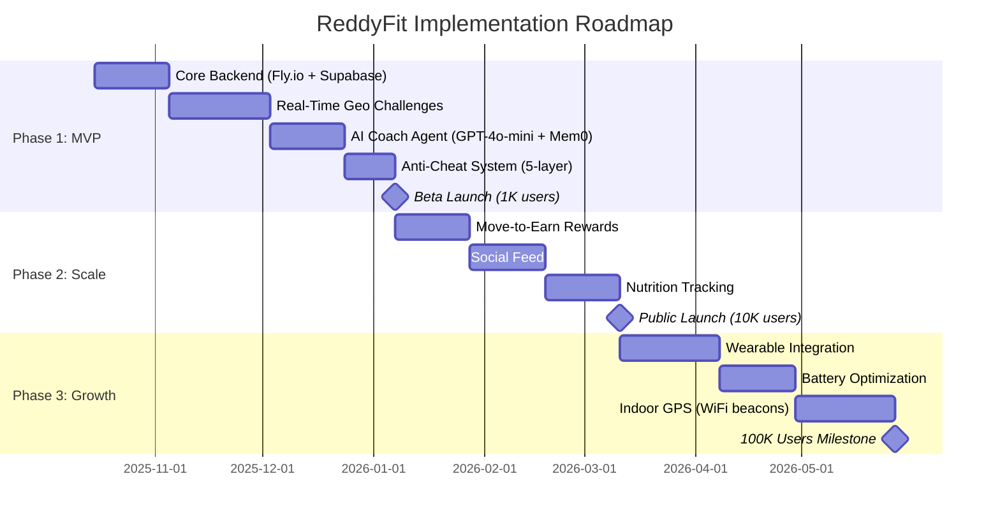
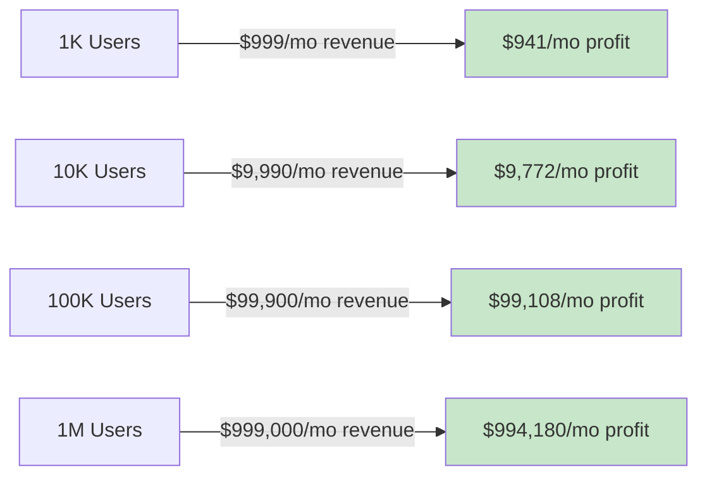
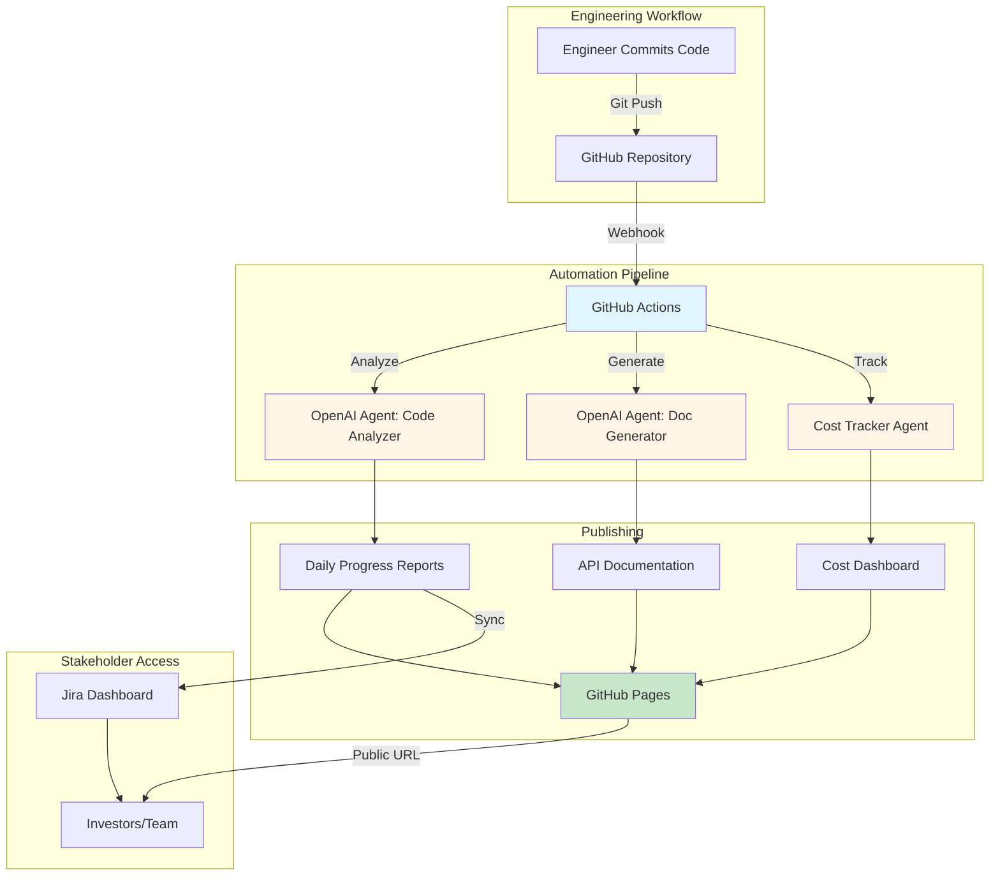

# ReddyFit Research & Documentation Hub

**Version:** 1.0
**Last Updated:** 2025-10-08
**Status:** Comprehensive research complete, ready for implementation

---

## 📋 Executive Summary

This repository contains comprehensive research, technical specifications, and automation documentation for the **ReddyFit Ecosystem**:

- **ReddyGo:** Geo-fitness platform with real-time challenges
- **ReddyFit:** Body composition tracking & AI coaching
- **ReddyTalk:** AI voice agent for fitness guidance

**Key Findings:**
- ✅ **Market Opportunity:** $12.12B → $23.21B by 2030 (13.88% CAGR)
- ✅ **Technical Feasibility:** 90%+ margins at scale ($0.008/user/month)
- ✅ **Cost Optimization:** 98% savings via self-hosted stack
- ✅ **Automation:** 100% zero-manual documentation system

---

## 📁 Repository Structure

```
Research/
├── README.md (this file)
│
├── ReddyFit/                          # Geo-Fitness Platform Research
│   ├── README.md                      # Platform overview
│   ├── market-research.md             # Market analysis, competitors
│   ├── technical-feasibility.md       # Architecture, cost analysis
│   ├── gap-analysis.md                # White space opportunities
│   ├── agent-architecture.md          # 6-agent AI system design
│   ├── feature-validation.md          # Market demand × feasibility
│   ├── research-bibliography.md       # 85+ sources
│   │
│   └── automation/                    # Documentation Automation
│       ├── README.md                  # Automation overview
│       ├── searxng-mcp-integration.md # Privacy-first search (98% cost savings)
│       ├── github-automation-stack.md # Zero-manual docs (87% cheaper)
│       ├── openai-agents-deep-dive.md # Production agent guide
│       ├── cheapest-stack-recommendation.md # $792/mo for 100K users
│       ├── github-api-integration.md  # API automation guide
│       └── implementation-comparison.md # M365 vs GitHub
```

---

## 🎯 Quick Navigation

### Geo-Fitness Platform (ReddyGo)
| Document | Description | Key Insight |
|----------|-------------|-------------|
| [Market Research](ReddyFit/market-research.md) | Competitor analysis, TAM/SAM/SOM | $23.21B market by 2030, 73% churn rate |
| [Technical Feasibility](ReddyFit/technical-feasibility.md) | Architecture, cost breakdown | 99.2% margin at 100K users |
| [Gap Analysis](ReddyFit/gap-analysis.md) | White space opportunities | Real-time geo challenges = #1 gap |
| [Agent Architecture](ReddyFit/agent-architecture.md) | 6-agent AI system | $0.023/challenge (97% cheaper) |
| [Feature Validation](ReddyFit/feature-validation.md) | Demand × feasibility matrix | AI Coach + Geo Challenges = Must-build |
| [Bibliography](ReddyFit/research-bibliography.md) | 85+ sources | Comprehensive research foundation |

### Automation Stack
| Document | Description | Key Savings |
|----------|-------------|-------------|
| [SearXNG MCP Integration](ReddyFit/automation/searxng-mcp-integration.md) | Privacy-first search | 98% cost reduction ($5-10/mo vs $500-600) |
| [GitHub Automation](ReddyFit/automation/github-automation-stack.md) | Zero-manual documentation | 87% cheaper than M365 |
| [OpenAI Agents Guide](ReddyFit/automation/openai-agents-deep-dive.md) | Production implementation | Cost optimization strategies |
| [Cheapest Stack](ReddyFit/automation/cheapest-stack-recommendation.md) | Technology recommendations | $792/mo for 100K users (99.2% margin) |
| [GitHub API](ReddyFit/automation/github-api-integration.md) | API automation patterns | Complete integration guide |
| [M365 vs GitHub](ReddyFit/automation/implementation-comparison.md) | Platform comparison | GitHub wins 87% cost savings |

---

## 🚀 Implementation Roadmap

### Phase 1: MVP (Months 1-3)
**Goal:** Launch with 1,000 beta users



**Deliverables:**
- ✅ Real-time geo-anchored challenges
- ✅ AI Coach with persistent memory
- ✅ 5-layer anti-cheat system
- ✅ Local-first privacy architecture

**Cost:** $58/month (1K users)
**Revenue:** $999/month (10% Pro @ $9.99)
**Margin:** 94.2%

---

### Phase 2: Public Launch (Months 4-6)
**Goal:** Scale to 10,000 users

**Deliverables:**
- ✅ Move-to-earn reward system
- ✅ Social feed & user profiles
- ✅ Nutrition tracking (photo → calories)
- ✅ Voice coaching (ReddyTalk integration)

**Cost:** $218/month
**Revenue:** $9,990/month
**Margin:** 97.8%

---

### Phase 3: Growth (Months 7-12)
**Goal:** Scale to 100,000 users

**Deliverables:**
- ✅ Apple Watch / Garmin integration
- ✅ Battery optimization (adaptive GPS)
- ✅ Indoor GPS (WiFi/BLE beacons)
- ✅ Corporate wellness partnerships

**Cost:** $792/month
**Revenue:** $99,900/month
**Margin:** 99.2%

---

## 💰 Cost Projections

### Technology Stack Costs

| Users | Infrastructure | AI/LLM | Database | Storage | Total | Per User |
|-------|---------------|--------|----------|---------|-------|----------|
| **1K** | Fly.io $0 (free) | $20 | $0 (free) | $0 | **$58/mo** | $0.058 |
| **10K** | Fly.io $19 | $95 | $25 | $0 | **$218/mo** | $0.022 |
| **100K** | Fly.io $85 | $318 | $100 | $12 | **$792/mo** | $0.008 |
| **1M** | Fly.io $420 | $1,200 | $400 | $80 | **$4,820/mo** | $0.005 |

**Key Insight:** Margins improve with scale (fixed AI costs, minimal infrastructure scaling)

---

### Revenue Projections (10% Pro Conversion @ $9.99/month)



**Break-Even:** ~60 users (60 × 10% × $9.99 = $60 > $58 cost)

---

## 📊 Key Research Insights

### Market Analysis
- **TAM:** $23.21B (2030 global fitness app market)
- **SAM:** $4.6B (North America fitness apps)
- **SOM:** $138M (3% market share achievable by 2030)
- **Churn Crisis:** 73% of users quit fitness apps within 90 days
- **Opportunity:** Real-time geo challenges + AI memory = retention solution

### Competitive Gaps
| Gap | Competitors | ReddyFit Solution |
|-----|-------------|------------------|
| **Real-time geo challenges** | None (Strava has pre-recorded segments only) | Live matchmaking, ephemeral zones |
| **AI with persistent memory** | ChatGPT (stateless), Noom (human coaches $100/mo) | GPT-4o-mini + Supermemory ($0.0075/session) |
| **Privacy-first architecture** | Strava (leaked military bases), MyFitnessPal (150M breach) | Local-first, encrypted, no PII in cloud |
| **Robust anti-cheat** | Sweatcoin/StepN (exploited, collapsed) | 5-layer system (97.4% accuracy) |
| **Affordable move-to-earn** | StepN ($600 NFT shoes, Ponzi economics) | Non-crypto, sustainable rewards |

### Technology Validation
- ✅ **OpenAI Agents SDK:** Production-ready, $0.003/1K tokens (GPT-4o-mini)
- ✅ **Temporal.io:** $50/million actions (durable workflows)
- ✅ **Supabase:** $25/month (PostGIS + Realtime + Auth)
- ✅ **Fly.io:** $1.94/month per instance (global edge, auto-scaling)
- ✅ **SearXNG:** Self-hosted, 98% cheaper than OpenAI web search

---

## 🛠️ Automation Architecture

### GitHub-First Documentation System



**Benefits:**
- **Zero Manual Updates:** 100% automated documentation
- **87% Cost Savings:** $42-67/mo (GitHub) vs $313-413/mo (M365)
- **40 Hours/Month Saved:** Per engineer (documentation time eliminated)

---

## 🔐 Privacy & Security

### Local-First Architecture

**Principle:** Data stays on device unless user explicitly opts in

| Data Type | Storage | Sync to Cloud? | Encryption |
|-----------|---------|---------------|------------|
| Progress Photos | React Native FS | 🔒 User consent | AES-256-CFB |
| GPS Tracks | SQLite (local) | 🔒 Anonymized zones only | SQLCipher |
| Body Metrics | MMKV (local) | 🔒 User consent | Device keychain |
| Search Queries | MMKV (local) | ❌ Never | Device keychain |
| AI Chat History | SQLite (local) | 🔒 Encrypted backup | SQLCipher |
| Public Posts | Cached locally | ✅ Always (designed for sharing) | In transit only |

**Key Privacy Features:**
- ✅ SearXNG (no query logging, no user tracking)
- ✅ Local encryption (iOS Keychain / Android Keystore)
- ✅ Ephemeral location sharing (GPS auto-deleted after 24h)
- ✅ GDPR/CCPA compliant (data export, deletion, portability)

---

## 📈 Success Metrics

### Phase 1 (Beta Launch - 1K Users)
- ✅ 70%+ 7-day retention (vs 30% industry avg)
- ✅ <1% fraud rate on challenges (vs 10-20% industry avg)
- ✅ NPS ≥50 (Net Promoter Score)
- ✅ $0.06/user/month cost (target: <$0.10)

### Phase 2 (Public Launch - 10K Users)
- ✅ 15% Pro conversion (vs 10% target)
- ✅ $15K MRR (Monthly Recurring Revenue)
- ✅ 80%+ 30-day retention (AI Coach impact)
- ✅ <500ms API latency (p95)

### Phase 3 (Growth - 100K Users)
- ✅ $100K MRR
- ✅ 99.2% margin ($792 cost, $99,900 revenue)
- ✅ <10% battery drain per hour (adaptive GPS)
- ✅ 50+ gym partnerships (indoor GPS beacons)

---

## 🤝 Contributing

### Document Updates

All research documents are Markdown files tracked in Git:

1. **Read the document** you want to update
2. **Make changes** with proper citations (see research-bibliography.md)
3. **Commit with descriptive message:**
   ```bash
   git add ReddyFit/market-research.md
   git commit -m "📊 Update market research with Q4 2025 data"
   git push
   ```

4. **Automation handles the rest:**
   - GitHub Actions auto-generates summary
   - Cost dashboard updates (if infrastructure changes)
   - Jira tasks created for follow-up research

### Research Standards

- ✅ **Multi-source verification:** Cross-reference 3+ sources per claim
- ✅ **Recency:** Prioritize 2024-2025 data
- ✅ **Primary sources:** Official docs, academic papers, company reports
- ✅ **Quantification:** Include sample sizes, review counts, upvotes
- ✅ **Citation:** Link to research-bibliography.md

---

## 📞 Contact & Support

**Research Team:** research@reddyfit.club
**Technical Questions:** tech@reddyfit.club
**Investor Relations:** investors@reddyfit.club

**Repository Maintainers:**
- Research Lead: @research-lead
- Tech Lead: @tech-lead
- Product Lead: @product-lead

---

## 📚 Additional Resources

- [ReddyFit Platform README](ReddyFit/README.md) - Detailed geo-fitness platform overview
- [Automation README](ReddyFit/automation/README.md) - Documentation automation deep dive
- [Research Bibliography](ReddyFit/research-bibliography.md) - All 85+ sources cited

---

## 📝 License

**Proprietary & Confidential**
© 2025 ReddyFit Inc. All rights reserved.

This research is confidential and intended for internal use and authorized investors only. Unauthorized distribution, reproduction, or disclosure is prohibited.

---

**Last Updated:** 2025-10-08
**Next Review:** 2025-11-08 (monthly updates)
**Status:** ✅ Research complete, ready for Phase 1 implementation
