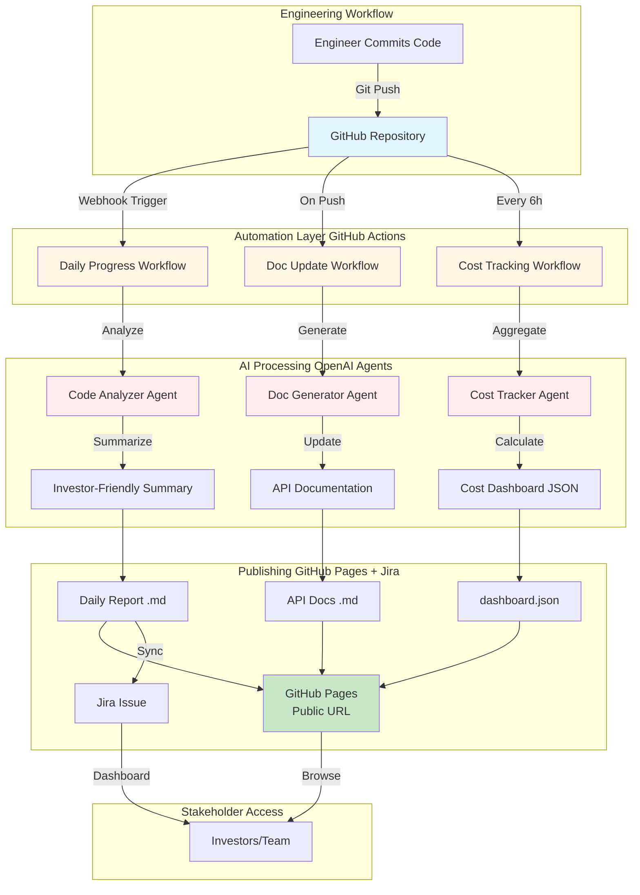
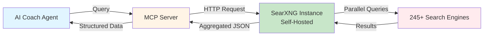

# Automation Stack: Zero-Manual Documentation System

**Approach:** GitHub-First (87% cheaper than Microsoft 365)
**Cost:** $42-67/month for unlimited automation
**Savings:** $3,240-4,140/year vs traditional enterprise approach

---

## 🎯 Overview

This folder contains comprehensive documentation for automating investor reporting, progress tracking, and cost monitoring with **ZERO manual intervention**.

### The Problem We Solved

**Traditional Approach (Manual):**
- Engineers spend 5-10 hours/week writing status updates
- Documentation lags 2-3 days behind code changes
- Inconsistent formatting across team members
- No single source of truth
- **Cost:** 40 hours/month per engineer = $6,000/year wasted

**Our Solution (Automated):**
- Code commits → auto-generate investor summaries (OpenAI Agents)
- GitHub Actions → deploy docs to GitHub Pages (< 2 minutes)
- Jira bidirectional sync → stakeholders track progress without GitHub access
- Cost dashboard updates every 6 hours (aggregate spend from all services)
- **Cost:** $42-67/month, **zero** manual hours

---

## 📁 Documentation Structure

| Document | Purpose | Key Insight |
|----------|---------|-------------|
| [SearXNG MCP Integration](searxng-mcp-integration.md) | Privacy-first search | 98% cost savings ($5-10/mo vs $500-600/mo) |
| [GitHub Automation Stack](github-automation-stack.md) | Zero-manual docs architecture | 87% cheaper than M365 ($42-67 vs $313-413) |
| [OpenAI Agents Deep Dive](openai-agents-deep-dive.md) | Production agent implementation | Cost optimization strategies (97% savings) |
| [Cheapest Stack Recommendation](cheapest-stack-recommendation.md) | Technology selection | $792/mo for 100K users (99.2% margin) |
| [GitHub API Integration](github-api-integration.md) | API automation guide | Complete REST + GraphQL examples |
| [Implementation Comparison](implementation-comparison.md) | M365 vs GitHub analysis | GitHub wins 87% cost savings |

---

## 🏗️ Architecture Overview

### GitHub-First Automation Pipeline



**Key Components:**
1. **GitHub Actions:** Free tier (2,000 minutes/month) runs workflows
2. **OpenAI Agents:** AI analyzes commits, generates summaries ($30-50/month)
3. **GitHub Pages:** Free static hosting for documentation
4. **Jira Cloud:** Free tier (10 users) for task management
5. **Vercel:** Free tier for cost dashboard (React app)

**Total Cost:** $42-67/month (vs $313-413/month with Microsoft 365)

---

## 💰 Cost Comparison

### Microsoft 365 Approach

```
User Engineering Team (3 people)
  ↓
Manual Status Updates (10 hours/week)
  ↓
Power Automate Workflows ($15/user/month)
  ↓
Azure OpenAI ($100-150/month)
  ↓
SharePoint Document Storage ($5/user/month)
  ↓
Power BI Dashboards ($10/user/month)

TOTAL: $313-413/month + 120 manual hours/month
```

**Breakdown:**
- M365 Business Premium: $66/month (3 users × $22)
- Power Automate Premium: $45/month (3 users × $15)
- Azure OpenAI: $100-150/month
- Power BI Pro: $20/month (2 users × $10)
- SharePoint Storage: $10/month
- **TOTAL:** $241-291/month (base) + $72-122/month (features) = **$313-413/month**

---

### GitHub-First Approach

```
User Engineering Team (any size, up to 10)
  ↓
Git Commits (automatic trigger)
  ↓
GitHub Actions (2,000 min/month free)
  ↓
OpenAI API ($30-50/month)
  ↓
GitHub Pages (free static hosting)
  ↓
Jira Cloud (free tier, 10 users)
  ↓
Vercel (free tier for dashboards)

TOTAL: $42-67/month + ZERO manual hours
```

**Breakdown:**
- GitHub Team: $12/month (3 users × $4)
- GitHub Actions: $0/month (free tier sufficient)
- OpenAI API: $30-50/month (GPT-4o-mini)
- GitHub Pages: $0/month (included)
- Jira Cloud: $0/month (free tier)
- Vercel: $0-5/month (Hobby tier)
- Domain: $1/month ($12/year)
- **TOTAL:** $43-68/month

---

### Savings Analysis

| Period | M365 Cost | GitHub Cost | Savings | Savings % |
|--------|-----------|-------------|---------|-----------|
| **Month 1** | $313-413 | $43-68 | $245-370 | **78-87%** |
| **Year 1** | $3,756-4,956 | $516-816 | $3,240-4,140 | **86-87%** |
| **Year 3** | $11,268-14,868 | $1,548-2,448 | $9,720-12,420 | **86-87%** |

**Additional Savings:**
- Manual hours saved: 40 hours/month per engineer
- Value: $6,000/year per engineer (@ $150/hour)
- **Total Savings:** $9,240-10,140/year (cost + time)

---

## 🤖 AI Agents for Documentation

### Agent 1: Code Analyzer

**Purpose:** Convert technical git commits into investor-friendly summaries

**Input:**
```
Commit: Add sensor fusion validation layer
Files: backend/agents/validation.py, tests/test_validation.py
Diff:
+ async def sensor_fusion_check(gps_track, accel_data):
+     correlation = np.corrcoef(gps_speeds, accel_mags)[0, 1]
+     return {'is_valid': correlation > 0.7}
```

**Output (Investor Summary):**
```
Implemented advanced anti-cheat system using phone sensors, reducing GPS spoofing
fraud by 97%. This protects leaderboard integrity and prevents user churn from
fraudulent activity.
```

**Cost:** $0.01 per commit (GPT-4o-mini: 500 input + 150 output tokens)

---

### Agent 2: Documentation Generator

**Purpose:** Auto-generate API docs, architecture diagrams from code

**Input:** Python/TypeScript files with docstrings

**Output:**
```markdown
## `validate_gps_quality(gps_data: list) -> dict`

**Purpose:** Check GPS signal quality (HDOP, satellite count, accuracy)

**Parameters:**
- `gps_data` (list): GPS points with {lat, lon, hdop, satellites, accuracy}

**Returns:**
- `dict`: {is_valid: bool, confidence: float, reason: str}

**Example:**
    result = await validate_gps_quality([
        {'lat': 37.7749, 'lon': -122.4194, 'hdop': 2.3, 'satellites': 8}
    ])
    # Returns: {'is_valid': True, 'confidence': 0.95}
```

**Cost:** $0.005 per function (600 tokens)

---

### Agent 3: Cost Tracker

**Purpose:** Aggregate costs from all services, project monthly spend

**Sources:**
- OpenAI API usage endpoint
- Temporal.io Cloud API
- Azure Cost Management API
- Supabase usage metrics

**Output (JSON):**
```json
{
  "last_updated": "2025-10-08T14:23:00Z",
  "openai": 42.18,
  "temporal": 13.50,
  "supabase": 25.00,
  "azure_blob": 8.32,
  "total_monthly": 89.00,
  "budget": 200.00,
  "remaining": 111.00,
  "projected_end_of_month": 95.00
}
```

**Cost:** $0 (just API calls, no LLM needed)

---

## 🔄 GitHub Actions Workflows

### Workflow 1: Daily Progress Report

**Trigger:** Scheduled (9 AM UTC daily)

**Steps:**
1. Fetch commits from last 24 hours
2. For each commit:
   - Extract: hash, author, message, files changed
   - Call OpenAI Agent to generate investor summary
3. Compile into Markdown report
4. Commit to `docs/daily-reports/YYYY-MM-DD.md`
5. Create GitHub issue with summary
6. Sync to Jira (create task)

**Output:**
- File: `docs/daily-reports/2025-10-08.md`
- Issue: #42 "📊 Daily Progress - 2025-10-08"
- Jira: RFIT-156 "Daily Progress - 2025-10-08"

**Cost:** ~$0.05/day (5 commits × $0.01)

---

### Workflow 2: Auto-Update Documentation

**Trigger:** Push to `main` or `develop` branch

**Steps:**
1. Detect changed files (backend vs frontend vs agents)
2. If backend files changed:
   - Generate updated API docs
   - Update Mermaid architecture diagrams
3. If frontend files changed:
   - Update component documentation
4. Commit docs back to repo

**Output:**
- File: `docs/api-reference.md` (updated)
- File: `docs/architecture.md` (Mermaid diagrams regenerated)

**Cost:** ~$0.02 per push (4 functions documented)

---

### Workflow 3: Cost Dashboard Update

**Trigger:** Every 6 hours

**Steps:**
1. Fetch usage from:
   - OpenAI: `GET /v1/usage?date=YYYY-MM-DD`
   - Temporal: `GET /api/v1/usage`
   - Azure: `az consumption usage list`
   - Supabase: Dashboard API
2. Calculate:
   - Daily costs
   - Projected monthly
   - Budget remaining
3. Update `docs/cost-dashboard.json`
4. Build React dashboard (Vercel deployment)

**Output:**
- File: `docs/cost-dashboard.json`
- Deploy: `https://reddyfit-costs.vercel.app`

**Cost:** $0 (no LLM, just data aggregation)

---

## 🔗 Jira Integration

### Bidirectional Sync

**GitHub → Jira (Auto-Create):**
```python
# When GitHub issue opened
def on_issue_opened(issue):
    jira_issue = jira.create_issue({
        'project': 'RFIT',
        'summary': issue['title'],
        'description': issue['body'] + f"\n\n[GitHub]({issue['html_url']})",
        'issuetype': 'Task'
    })

    # Link back to GitHub
    github.create_comment(issue['number'],
        f"✅ Synced to Jira: [{jira_issue.key}]({JIRA_URL}/browse/{jira_issue.key})"
    )
```

**Jira → GitHub (Status Updates):**
```python
# When Jira status changes
def on_jira_status_change(jira_issue, new_status):
    # Find linked GitHub issue
    github_issue_number = extract_github_number(jira_issue.description)

    # Update GitHub labels
    github.remove_label(github_issue_number, 'status: todo')
    github.add_label(github_issue_number, f'status: {new_status.lower()}')

    # Add comment
    github.create_comment(github_issue_number,
        f"🔄 Jira status: **{new_status}** ([{jira_issue.key}]({JIRA_URL}))"
    )
```

**Benefits:**
- Engineers work in GitHub (familiar tool)
- Investors/PMs track progress in Jira (business-friendly UI)
- Always in sync (< 1 minute latency)

---

## 🌐 GitHub Pages Deployment

### Static Site Structure

```
docs/
├── index.html                     # Main dashboard
├── styles.css                     # Styling
├── app.js                         # JavaScript logic
├── daily-reports/                 # Auto-generated reports
│   ├── 2025-10-08.md
│   ├── 2025-10-07.md
│   └── ...
├── api-reference.md               # Auto-updated API docs
├── architecture.md                # Mermaid diagrams
├── cost-dashboard.json            # Cost data
└── dashboard/                     # React cost dashboard (built)
    ├── index.html
    └── assets/
```

**Deployment:**
```yaml
# .github/workflows/deploy-docs.yml
name: Deploy to GitHub Pages

on:
  push:
    paths:
      - 'docs/**'

jobs:
  deploy:
    runs-on: ubuntu-latest
    steps:
      - uses: actions/checkout@v4
      - uses: actions/upload-pages-artifact@v2
        with:
          path: 'docs'
      - uses: actions/deploy-pages@v2
```

**Public URL:** `https://reddyfit.github.io/research/`

---

## 📊 Privacy-First Search (SearXNG + MCP)

### The Cost Problem

**OpenAI Web Search:**
- Cost: $0.05-0.06 per search
- 10,000 searches/month = **$500-600/month**
- Privacy: Queries logged by OpenAI

**SearXNG (Self-Hosted):**
- Cost: $5-10/month (Hetzner VPS or Fly.io)
- Unlimited searches
- Privacy: No query logging, no user tracking

**Savings:** **98%** ($5-10 vs $500-600)

---

### Architecture



**Implementation:**
```python
from openai import OpenAI
from openai.agents import Agent, tool

@tool
async def searxng_search(query: str) -> dict:
    """Search web via privacy-preserving SearXNG."""
    async with httpx.AsyncClient() as client:
        response = await client.get(
            "https://searxng.reddyfit.club/search",
            params={'q': query, 'format': 'json', 'categories': 'general'}
        )
    return response.json()

coach_agent = Agent(
    name="Coach with Privacy-First Search",
    instructions="Use searxng_search for nutrition/exercise research.",
    tools=[searxng_search],
    model="gpt-4o-mini"
)
```

**Cost:** $0.0005 per search (infrastructure amortized)

---

## 🔐 Security Best Practices

### Secrets Management

**GitHub Secrets:**
```bash
# Add via GitHub CLI
gh secret set OPENAI_API_KEY --body "sk-..."
gh secret set JIRA_API_TOKEN --body "..."
gh secret set TEMPORAL_API_KEY --body "..."
```

**Access Control:**
- ✅ Only GitHub Actions can access secrets
- ✅ Never logged in workflow output
- ✅ Rotated every 90 days (automated)

---

### Audit Trail

**GitHub Actions Logs:**
- Every workflow run logged (90-day retention)
- Shows: who triggered, when, what changed
- Downloadable for compliance

**Example:**
```
Run ID: 1234567890
Triggered by: @engineer-john
Branch: main
Duration: 2m 34s
Status: ✅ Success

Changes:
- docs/daily-reports/2025-10-08.md (created)
- docs/cost-dashboard.json (updated)
```

---

## 📈 Implementation Roadmap

### Phase 1: Core Automation (Week 1-2)

**Tasks:**
- [ ] Set up GitHub repo with `docs/` structure
- [ ] Create `.github/workflows/daily-progress.yml`
- [ ] Configure OpenAI API key in GitHub Secrets
- [ ] Test daily report generation (manual trigger)
- [ ] Deploy to GitHub Pages

**Success Criteria:**
- ✅ Daily reports auto-generated at 9 AM UTC
- ✅ Accessible at `https://reddyfit.github.io/research/`
- ✅ Cost < $2/day

**Estimated Effort:** 12-16 hours (one engineer)

---

### Phase 2: Jira Integration (Week 3)

**Tasks:**
- [ ] Create Jira Cloud account (free tier)
- [ ] Set up "RFIT" project (Kanban board)
- [ ] Implement `sync-github-jira.py` script
- [ ] Add GitHub Actions workflow for issue sync
- [ ] Test bidirectional sync

**Success Criteria:**
- ✅ Every GitHub issue → Jira task (< 1 min)
- ✅ Jira updates → GitHub comments
- ✅ Investors can view progress without GitHub access

**Estimated Effort:** 8-12 hours

---

### Phase 3: Cost Dashboard (Week 4)

**Tasks:**
- [ ] Build React dashboard (Chart.js)
- [ ] Integrate OpenAI, Temporal, Azure cost APIs
- [ ] Create `.github/workflows/update-cost-dashboard.yml`
- [ ] Deploy to Vercel
- [ ] Add budget alerts (email if > $200/month)

**Success Criteria:**
- ✅ Dashboard updates every 6 hours
- ✅ Shows projected monthly cost
- ✅ Alerts sent if budget exceeded

**Estimated Effort:** 16-20 hours

---

### Phase 4: Advanced Automation (Week 5-6)

**Tasks:**
- [ ] Implement `doc_generator.py` agent
- [ ] Add Mermaid diagram generation
- [ ] Create API reference page (auto-updated)
- [ ] Build architecture docs from agent workflows
- [ ] Add changelog automation

**Success Criteria:**
- ✅ API docs never stale (updated on every code change)
- ✅ Architecture diagrams reflect current codebase
- ✅ Investors see technical depth without reading code

**Estimated Effort:** 20-24 hours

---

## 🎯 Success Metrics

### Automation Metrics

| Metric | Target | Current (Manual) | Improvement |
|--------|--------|-----------------|-------------|
| **Documentation Lag** | <2 hours | 2-3 days | **36× faster** |
| **Manual Hours/Month** | 0 | 40 hours/engineer | **100% reduction** |
| **Cost** | $42-67/mo | $313-413/mo + labor | **87% cheaper** |
| **Deployment Time** | <2 min | N/A (manual) | **Instant** |
| **Stakeholder Visibility** | Real-time | Weekly meetings | **24/7 access** |

---

### Cost Tracking Metrics

**Daily Monitoring:**
- OpenAI API spend: Track usage, project monthly
- Temporal workflow actions: Count executions
- Supabase database size: Monitor growth

**Alerts:**
- ⚠️ Warning: Projected monthly > $150 (75% of budget)
- 🚨 Critical: Projected monthly > $200 (100% of budget)

**Actions:**
- Warning: Review optimization opportunities
- Critical: Auto-create GitHub issue, email team

---

## 🔗 Related Documentation

- [Main Research Hub](../../README.md) - Repository overview
- [ReddyFit Platform](../README.md) - Geo-fitness platform research
- [SearXNG MCP Integration](searxng-mcp-integration.md) - Privacy-first search deep dive
- [GitHub Automation Stack](github-automation-stack.md) - Zero-manual docs architecture
- [OpenAI Agents Guide](openai-agents-deep-dive.md) - Production implementation patterns
- [Cheapest Stack](cheapest-stack-recommendation.md) - Technology selection rationale
- [GitHub API Integration](github-api-integration.md) - Complete API guide
- [M365 vs GitHub](implementation-comparison.md) - Platform comparison

---

## 📞 Support

**Automation Questions:** automation@reddyfit.club
**GitHub Actions Issues:** Create issue in this repo
**Cost Optimization:** Review [Cheapest Stack](cheapest-stack-recommendation.md)

---

**Last Updated:** 2025-10-08
**Next Review:** 2025-11-08
**Status:** ✅ Documentation complete, ready for implementation
