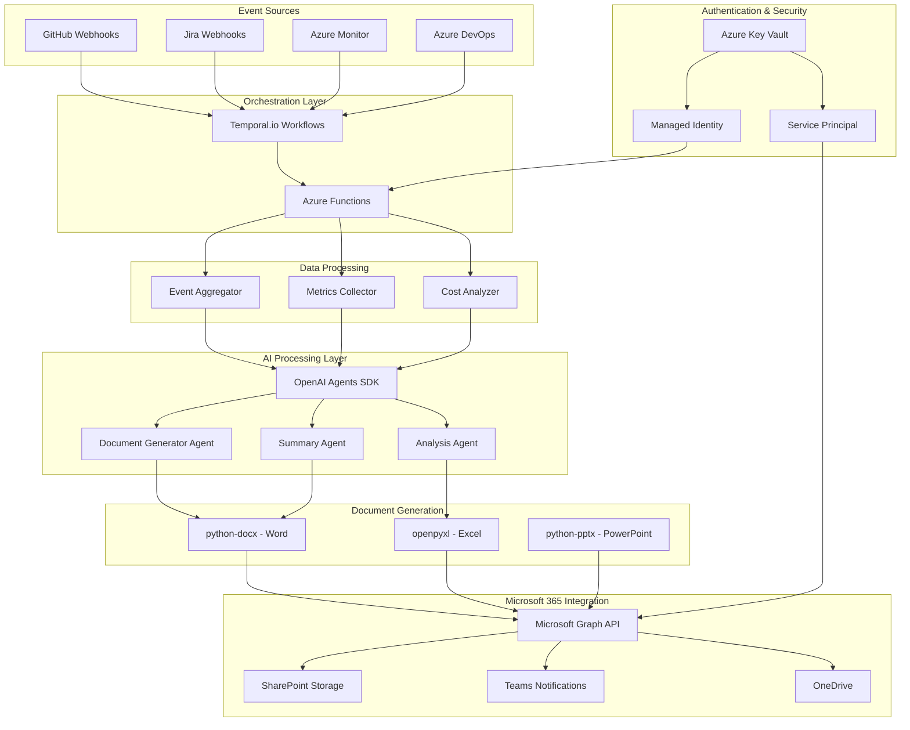
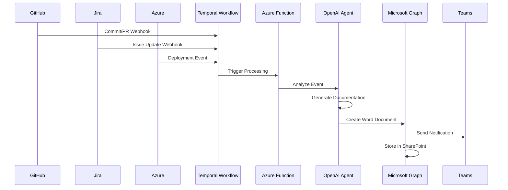
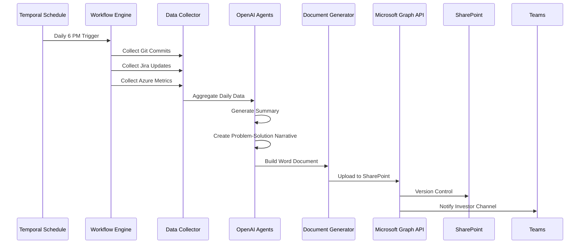
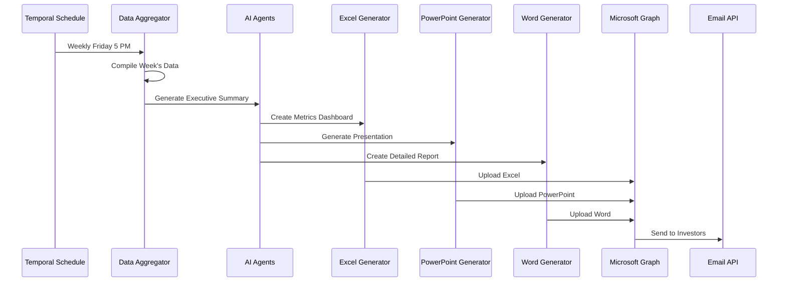

# Automated Documentation and Investor Reporting System Architecture

## Executive Summary

This document outlines a fully automated documentation and investor reporting system that integrates Microsoft 365, Jira, Azure infrastructure, OpenAI Agents, and Temporal.io for workflow orchestration. The system monitors development activities, generates documentation in real-time, and produces comprehensive investor reports automatically.

## System Architecture



## Data Flow Architecture

### 1. Real-Time Event Processing Flow



### 2. Daily Documentation Workflow



### 3. Weekly Investor Report Workflow



## Component Architecture

### 1. Authentication & Security Model

```
┌─────────────────────────────────────────────────────────┐
│                  Azure Key Vault                        │
│  ┌────────────────────────────────────────────────┐   │
│  │ Secrets Storage:                                │   │
│  │ - Microsoft Graph API Client Secret            │   │
│  │ - Jira API Token                                │   │
│  │ - GitHub Personal Access Token                  │   │
│  │ - OpenAI API Key                                │   │
│  │ - Service Principal Certificate                 │   │
│  └────────────────────────────────────────────────┘   │
└─────────────────────────────────────────────────────────┘
                         │
                         ▼
┌─────────────────────────────────────────────────────────┐
│           Authentication Strategy                       │
│                                                         │
│  Production:                                            │
│  - Managed Identity (Azure Functions)                   │
│  - Service Principal with Certificate (M365)            │
│  - OAuth 2.0 Client Credentials Flow                    │
│                                                         │
│  Development:                                           │
│  - Service Principal with Secret                        │
│  - User Principal (Testing)                             │
└─────────────────────────────────────────────────────────┘
```

### 2. Microsoft Graph API Integration

**Required API Permissions:**

Application Permissions (Admin Consent Required):
- `Files.ReadWrite.All` - SharePoint/OneDrive document management
- `Sites.ReadWrite.All` - SharePoint site access
- `ChannelMessage.Send` - Teams notifications
- `Mail.Send` - Email investor reports
- `User.Read.All` - User information for audit trails

**Rate Limits:**
- Global: 130,000 requests per 10 seconds per app
- Per-tenant: Varies by service
- **Important:** Starting Sept 30, 2025, per-app/per-user limit reduced to 50% of tenant quota

**Authentication Flow:**
```
1. Register App in Azure AD
2. Grant Application Permissions
3. Admin Consent
4. Acquire Access Token (OAuth 2.0 Client Credentials)
5. Call Microsoft Graph API
6. Refresh Token (every 60 minutes)
```

### 3. Jira Integration

**API Endpoints:**
- REST API v3: `https://your-domain.atlassian.net/rest/api/3/`
- Authentication: OAuth 2.0 or API Token

**Webhooks Configuration:**
```json
{
  "name": "ReddyFit Documentation Automation",
  "url": "https://your-azure-function.azurewebsites.net/api/jira-webhook",
  "events": [
    "jira:issue_created",
    "jira:issue_updated",
    "sprint_started",
    "sprint_closed"
  ],
  "jqlFilter": "project = REDDYFIT"
}
```

**Rate Limits:**
- Cloud: Not publicly disclosed, monitored per-user/per-app
- Recommended: Implement exponential backoff
- Webhook Limits: 100 webhooks per app (Connect), 5 per user (OAuth 2.0)

### 4. Azure CLI/SDK Integration

**Python SDK Packages:**
```python
# Required packages
azure-mgmt-costmanagement  # Cost analysis
azure-mgmt-monitor         # Resource monitoring
azure-mgmt-resource        # Resource management
azure-identity             # Authentication
azure-devops              # Azure DevOps API
```

**Capabilities:**
- Query resource usage and costs
- Monitor deployments
- Track Azure DevOps pipeline status
- Analyze billing data
- Monitor application performance

**Sample Implementation:**
```python
from azure.identity import DefaultAzureCredential
from azure.mgmt.costmanagement import CostManagementClient

credential = DefaultAzureCredential()
client = CostManagementClient(credential)

# Query costs for subscription
scope = f"/subscriptions/{subscription_id}"
query = {
    "type": "Usage",
    "timeframe": "MonthToDate",
    "dataset": {
        "granularity": "Daily",
        "aggregation": {
            "totalCost": {
                "name": "Cost",
                "function": "Sum"
            }
        }
    }
}
```

### 5. OpenAI Agents SDK

**Multi-Agent Architecture:**

```
Manager Agent (Orchestrator)
    ├── Documentation Writer Agent
    │   ├── Analyzes code commits
    │   ├── Generates technical documentation
    │   └── Creates problem-solution narratives
    │
    ├── Executive Summary Agent
    │   ├── Aggregates weekly progress
    │   ├── Generates investor-focused summaries
    │   └── Highlights key metrics
    │
    ├── Data Analyst Agent
    │   ├── Processes Jira metrics
    │   ├── Analyzes Azure costs
    │   └── Generates charts and visualizations
    │
    └── Quality Reviewer Agent
        ├── Reviews generated documentation
        ├── Ensures accuracy
        └── Validates formatting
```

**Orchestration Pattern:**
- Manager-as-tool: Central orchestrator invokes specialized agents
- Handoffs: Agents transfer control for specific tasks
- Session Management: Automatic conversation history tracking

**Agent Configuration:**
```python
from openai_agents import Agent, Handoff

doc_writer = Agent(
    name="Documentation Writer",
    instructions="""Analyze code changes and generate clear,
                   technical documentation explaining what changed
                   and why.""",
    model="gpt-4"
)

exec_summary = Agent(
    name="Executive Summary Writer",
    instructions="""Create investor-focused summaries highlighting
                   progress, blockers, and next steps.""",
    model="gpt-4"
)

manager = Agent(
    name="Documentation Manager",
    instructions="Coordinate documentation tasks",
    handoffs=[doc_writer, exec_summary]
)
```

### 6. Temporal.io Workflows

**Schedule Configuration:**

```python
# Daily Documentation Workflow
@workflow.defn
class DailyDocumentationWorkflow:
    @workflow.run
    async def run(self) -> str:
        # Collect data from all sources
        commits = await workflow.execute_activity(
            collect_github_commits,
            start_to_close_timeout=timedelta(minutes=5)
        )

        jira_updates = await workflow.execute_activity(
            collect_jira_updates,
            start_to_close_timeout=timedelta(minutes=5)
        )

        azure_metrics = await workflow.execute_activity(
            collect_azure_metrics,
            start_to_close_timeout=timedelta(minutes=5)
        )

        # Generate documentation with AI
        doc_content = await workflow.execute_activity(
            generate_daily_summary,
            args=[commits, jira_updates, azure_metrics],
            start_to_close_timeout=timedelta(minutes=10)
        )

        # Create Word document
        doc_path = await workflow.execute_activity(
            create_word_document,
            args=[doc_content],
            start_to_close_timeout=timedelta(minutes=3)
        )

        # Upload to SharePoint
        sharepoint_url = await workflow.execute_activity(
            upload_to_sharepoint,
            args=[doc_path],
            start_to_close_timeout=timedelta(minutes=5)
        )

        # Send Teams notification
        await workflow.execute_activity(
            send_teams_notification,
            args=[sharepoint_url],
            start_to_close_timeout=timedelta(minutes=2)
        )

        return sharepoint_url

# Schedule: Daily at 6 PM
schedule = Schedule(
    action=ScheduleActionStartWorkflow(
        workflow=DailyDocumentationWorkflow.run,
        id="daily-doc-workflow",
        task_queue="documentation-tasks"
    ),
    spec=ScheduleSpec(
        calendars=[
            ScheduleCalendarSpec(
                hour=18,  # 6 PM
                minute=0
            )
        ]
    )
)
```

**Weekly Investor Report Schedule:**
```python
# Weekly Report - Every Friday at 5 PM
weekly_schedule = Schedule(
    action=ScheduleActionStartWorkflow(
        workflow=WeeklyInvestorReportWorkflow.run,
        id="weekly-investor-report",
        task_queue="reporting-tasks"
    ),
    spec=ScheduleSpec(
        calendars=[
            ScheduleCalendarSpec(
                day_of_week=5,  # Friday
                hour=17,        # 5 PM
                minute=0
            )
        ]
    )
)
```

**Error Handling & Retry Logic:**
```python
@activity.defn
async def upload_to_sharepoint(file_path: str) -> str:
    return await workflow.execute_activity(
        upload_activity,
        args=[file_path],
        start_to_close_timeout=timedelta(minutes=5),
        retry_policy=RetryPolicy(
            initial_interval=timedelta(seconds=1),
            maximum_interval=timedelta(seconds=30),
            maximum_attempts=5,
            backoff_coefficient=2.0
        )
    )
```

## Infrastructure Deployment

### Serverless Architecture (Azure Functions)

**Consumption Plan Benefits:**
- Pay only when functions execute
- Automatic scaling
- 1M free executions/month
- 400,000 GB-s free compute/month

**Function Apps Structure:**
```
reddyfit-automation/
├── github-webhook-handler/
├── jira-webhook-handler/
├── azure-monitor-collector/
├── daily-doc-generator/
├── weekly-report-generator/
├── sharepoint-uploader/
└── teams-notifier/
```

**Estimated Monthly Executions:**
- GitHub webhooks: ~1,000 (commits/PRs)
- Jira webhooks: ~500 (ticket updates)
- Daily documentation: 30 executions
- Weekly reports: 4 executions
- Real-time notifications: ~1,500

**Total: ~3,034 executions/month (well within free tier)**

## Security Architecture

### Zero Trust Security Model

```
┌─────────────────────────────────────────────────────┐
│  Security Layers                                    │
│                                                     │
│  1. Network Security                                │
│     - Azure Functions in VNet                       │
│     - Private endpoints for Key Vault               │
│     - NSG rules for webhook endpoints               │
│                                                     │
│  2. Identity & Access                               │
│     - Managed Identity (primary)                    │
│     - Service Principal with certificate (backup)   │
│     - Azure RBAC for resource access                │
│     - M365 Application Permissions                  │
│                                                     │
│  3. Data Protection                                 │
│     - Secrets in Azure Key Vault                    │
│     - Encryption at rest (SharePoint)               │
│     - TLS 1.3 for all API calls                     │
│     - Purge protection on Key Vault                 │
│                                                     │
│  4. Monitoring & Audit                              │
│     - Azure Monitor logs                            │
│     - Key Vault access logging                      │
│     - Microsoft Graph audit logs                    │
│     - Temporal workflow history                     │
│                                                     │
│  5. Compliance                                      │
│     - 60-day secret rotation                        │
│     - Least privilege access                        │
│     - Multi-factor authentication                   │
│     - Data residency controls                       │
└─────────────────────────────────────────────────────┘
```

### Secret Management Strategy

**Secret Rotation Schedule:**
- Service Principal Secrets: Every 60 days
- API Tokens: Every 90 days
- Certificates: Every 12 months

**Access Control:**
- Key Vault: Role-based access control (RBAC)
- Secrets Access: Only Managed Identity and approved Service Principals
- No individual user access to production secrets

## Cost Breakdown Estimate

### Monthly Operating Costs

| Service | Usage | Cost |
|---------|-------|------|
| **Microsoft Graph API** | Free tier | $0.00 |
| **Jira Cloud API** | Standard plan | $0.00 |
| **Azure Functions** | 3,034 executions, ~50 GB-s | $0.00 (within free tier) |
| **Azure Key Vault** | 10 secrets, 5,000 operations | $0.03 |
| **Temporal Cloud (Essentials)** | 250K actions/month | $100.00 |
| **OpenAI API (GPT-4)** | ~500K tokens/month | $15.00 |
| **Azure Storage (SharePoint alternative)** | 100 GB | $0.00 (using M365) |
| **Azure Monitor** | Basic metrics | $0.00 (within free tier) |
| **GitHub Webhooks** | Free | $0.00 |
| **Teams Notifications** | Free | $0.00 |
| **TOTAL MONTHLY** | | **$115.03** |
| **TOTAL ANNUAL** | | **$1,380.36** |

### Cost Optimization Options

1. **Self-Host Temporal** (saves $100/month):
   - Requires: 2 small VMs ($50/month)
   - Net savings: $50/month
   - Trade-off: More operational complexity

2. **Use GPT-3.5 Turbo instead of GPT-4**:
   - Reduce OpenAI costs by 90%
   - ~$1.50/month instead of $15
   - Trade-off: Lower quality summaries

3. **Alternative: Prefect Cloud** (instead of Temporal):
   - Free tier: Up to 20,000 task runs/month
   - Savings: $100/month
   - Trade-off: Different workflow paradigm

**Optimized Annual Cost: $180 - $1,380** (depending on choices)

## Scalability Considerations

### Current Load Estimate
- Daily commits: ~30
- Jira updates: ~20/day
- Azure deployments: ~5/week
- Document generations: 30 daily + 4 weekly = 34/month

### Scale Targets (Year 2)
- Daily commits: ~200
- Jira updates: ~100/day
- Azure deployments: ~30/week
- Document generations: 30 daily + 4 weekly = 34/month

### Scaling Strategy

**Horizontal Scaling:**
- Azure Functions automatically scale
- Temporal Cloud handles increased workflow volume
- Microsoft Graph API rate limits sufficient for 10x growth

**Performance Optimization:**
- Cache Microsoft Graph tokens (8-hour lifetime)
- Batch API requests where possible
- Use Temporal sessions for workflow state
- Implement exponential backoff on all API calls

## Disaster Recovery & Business Continuity

### Backup Strategy
- SharePoint: Native versioning (30 days)
- Temporal workflows: Built-in event sourcing
- Azure Functions: Infrastructure as Code (ARM templates)
- Configuration: Stored in Git

### Recovery Time Objectives (RTO)
- Microsoft Graph API down: Use cached data, RTO: 0 minutes
- Temporal Cloud down: Queue events, RTO: 15 minutes
- Azure Functions down: Redeploy, RTO: 30 minutes
- OpenAI API down: Fall back to template-based docs, RTO: 5 minutes

### Failure Handling

```python
# Example: Graceful degradation when OpenAI fails
async def generate_summary(data):
    try:
        # Try AI generation
        summary = await openai_agent.generate(data)
    except OpenAIError:
        # Fall back to template
        summary = generate_template_summary(data)
        logger.warning("OpenAI unavailable, using template")

    return summary
```

## Monitoring & Observability

### Key Metrics

**System Health:**
- Temporal workflow success rate: Target >99%
- API call success rate: Target >99.5%
- Document generation latency: Target <2 minutes
- SharePoint upload success: Target >99.9%

**Business Metrics:**
- Daily documentation completeness: 100%
- Weekly report delivery: 100% on-time
- Investor notification delivery: 100%
- Documentation accuracy (manual review): >95%

### Alerting Strategy

**Critical Alerts (PagerDuty/Teams):**
- Workflow failure 3 times in a row
- Authentication failure (Key Vault/Graph API)
- SharePoint quota exceeded
- Weekly report generation failed

**Warning Alerts (Email):**
- API rate limit approaching (80%)
- OpenAI costs exceeding budget
- Unusual number of retries
- Temporal workflow delays

## Compliance & Governance

### Data Handling
- All documents stored in SharePoint (M365 compliance)
- No PII in automated documentation
- Audit trails via Microsoft Graph logs
- 90-day retention for workflow logs

### Access Controls
- Investor channel: Read-only for investors
- SharePoint: Version control enabled
- Document approval workflow: Optional manual review
- Admin access: MFA required

---

## Summary

This architecture provides a robust, scalable, and cost-effective solution for automated documentation and investor reporting. Key benefits:

1. **Fully Automated**: Zero manual intervention for daily/weekly reports
2. **Cost-Efficient**: $115/month operating cost (optimizable to $15/month)
3. **Scalable**: Handles 10x growth without infrastructure changes
4. **Reliable**: Built-in retry logic, error handling, and failover
5. **Secure**: Zero Trust model, certificate-based auth, secret rotation
6. **Compliant**: M365 native storage, audit trails, access controls

The system integrates seamlessly with existing development workflows while providing real-time documentation and professional investor reporting with minimal operational overhead.
