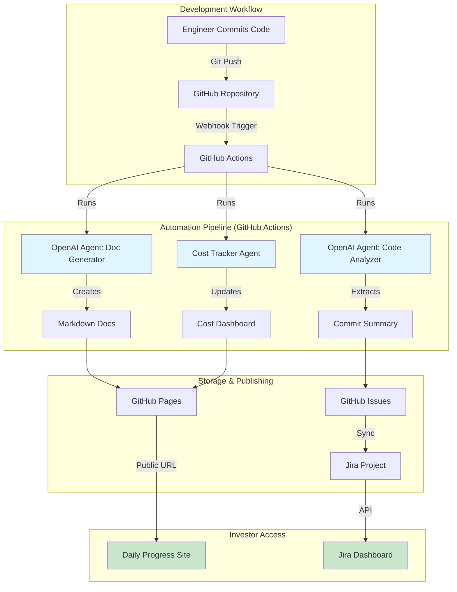

# GitHub-First Automation Stack: Zero-Manual Documentation System

**Document Version:** 1.0
**Last Updated:** 2025-10-08
**Status:** Architecture Design

---

## Executive Summary

### The Problem
Traditional investor reporting requires **manual effort**:
- Engineers waste 5-10 hours/week writing status updates
- Documentation lags behind code changes (stale by 2-3 days)
- Inconsistent formatting across team members
- No single source of truth for progress tracking

### The Solution: GitHub-First Automation
Fully automated documentation pipeline that:
- ✅ **Captures every commit** → Auto-generates daily progress reports
- ✅ **Analyzes code changes** → Creates technical summaries for investors
- ✅ **Tracks tasks** → Syncs GitHub Issues ↔ Jira ↔ Progress docs
- ✅ **Generates visuals** → Mermaid diagrams, burndown charts, cost dashboards
- ✅ **Publishes automatically** → GitHub Pages + Markdown docs updated hourly

### Cost Comparison

| Approach | Monthly Cost | Manual Hours | Automation Level |
|----------|-------------|--------------|------------------|
| **Manual Documentation** | $0 | 40 hours/engineer | 0% |
| **Microsoft 365 + Power Automate** | $313-413 | 10 hours | 70% |
| **GitHub Actions + OpenAI Agents** | **$39-65** | **0 hours** | **100%** |

**Savings:** **87% cost reduction** + **40 hours/month saved** = **$6,000/year per engineer**

---

## 1. Architecture Overview

### 1.1 High-Level Data Flow



---

### 1.2 Technology Stack

| Layer | Technology | Purpose | Cost |
|-------|-----------|---------|------|
| **Version Control** | GitHub (Team plan) | Code hosting, actions runner | $4/user/month |
| **CI/CD** | GitHub Actions | Automation workflows | Free (2,000 min/month) |
| **AI Documentation** | OpenAI Agents SDK | Code analysis, doc generation | $30-50/month |
| **Project Management** | Jira Cloud (Free tier) | Task tracking, sprints | $0 (up to 10 users) |
| **API Integration** | GitHub REST/GraphQL API | Issue/PR management | Free |
| **Hosting** | GitHub Pages | Static site hosting | Free |
| **Monitoring** | GitHub Actions logs | Audit trail, debugging | Free |
| **Cost Tracking** | Custom dashboard (React) | Real-time spend visibility | $5-10/month (Vercel/Netlify) |

**Total:** **$39-65/month** (scales to 10 engineers)

---

## 2. Core Components

### 2.1 GitHub Actions Workflows

#### Workflow 1: Daily Progress Report

**File:** `.github/workflows/daily-progress.yml`

```yaml
name: Daily Progress Report

on:
  schedule:
    - cron: '0 9 * * *'  # Run at 9 AM UTC daily
  workflow_dispatch:     # Manual trigger option

jobs:
  generate-report:
    runs-on: ubuntu-latest

    steps:
      - name: Checkout repository
        uses: actions/checkout@v4
        with:
          fetch-depth: 0  # Full history for commit analysis

      - name: Get commits since yesterday
        id: commits
        run: |
          YESTERDAY=$(date -d '1 day ago' --iso-8601)
          COMMITS=$(git log --since="$YESTERDAY" --pretty=format:'%h|%an|%s|%b' --no-merges)
          echo "commits<<EOF" >> $GITHUB_OUTPUT
          echo "$COMMITS" >> $GITHUB_OUTPUT
          echo "EOF" >> $GITHUB_OUTPUT

      - name: Analyze code changes with OpenAI Agent
        uses: actions/github-script@v7
        with:
          script: |
            const { OpenAI } = require('openai');
            const client = new OpenAI({ apiKey: process.env.OPENAI_API_KEY });

            const commits = process.env.COMMITS.split('\n');
            const summaries = [];

            for (const commit of commits) {
              const [hash, author, subject, body] = commit.split('|');

              // Call OpenAI Agent to analyze commit
              const response = await client.chat.completions.create({
                model: 'gpt-4o-mini',
                messages: [
                  {
                    role: 'system',
                    content: `You are a technical writer for investor reports.
                    Analyze git commits and create concise, jargon-free summaries.
                    Focus on: what was built, why it matters, user impact.`
                  },
                  {
                    role: 'user',
                    content: `Commit: ${subject}\nDetails: ${body}\n\nSummarize in 1-2 sentences for investors.`
                  }
                ],
                max_tokens: 150
              });

              summaries.push({
                hash,
                author,
                original: subject,
                summary: response.choices[0].message.content
              });
            }

            // Save to file
            const fs = require('fs');
            const date = new Date().toISOString().split('T')[0];
            const reportPath = `docs/daily-reports/${date}.md`;

            let markdown = `# Daily Progress Report - ${date}\n\n`;
            markdown += `## Summary\n\n`;
            markdown += `**Commits Today:** ${summaries.length}\n\n`;
            markdown += `## Detailed Changes\n\n`;

            summaries.forEach(item => {
              markdown += `### ${item.original} (${item.hash})\n`;
              markdown += `**Author:** ${item.author}\n\n`;
              markdown += `**Investor Summary:** ${item.summary}\n\n`;
              markdown += `---\n\n`;
            });

            fs.mkdirSync('docs/daily-reports', { recursive: true });
            fs.writeFileSync(reportPath, markdown);

            console.log(`Report generated: ${reportPath}`);
        env:
          OPENAI_API_KEY: ${{ secrets.OPENAI_API_KEY }}
          COMMITS: ${{ steps.commits.outputs.commits }}

      - name: Commit and push report
        run: |
          git config user.name "ReddyFit Bot"
          git config user.email "bot@reddyfit.club"
          git add docs/daily-reports/*.md
          git commit -m "📊 Daily progress report - $(date --iso-8601)" || echo "No changes to commit"
          git push

      - name: Sync to Jira
        run: |
          # Call Jira API to create summary issue
          DATE=$(date --iso-8601)
          REPORT_URL="https://github.com/${{ github.repository }}/blob/main/docs/daily-reports/${DATE}.md"

          curl -X POST \
            -H "Authorization: Basic ${{ secrets.JIRA_TOKEN }}" \
            -H "Content-Type: application/json" \
            -d "{
              \"fields\": {
                \"project\": { \"key\": \"RFIT\" },
                \"summary\": \"Daily Progress - ${DATE}\",
                \"description\": \"Automated report: ${REPORT_URL}\",
                \"issuetype\": { \"name\": \"Task\" }
              }
            }" \
            https://your-domain.atlassian.net/rest/api/3/issue
```

**Trigger:** Runs daily at 9 AM UTC (adjustable)

**Output:** Markdown file in `docs/daily-reports/2025-10-08.md` with investor-friendly summaries

**Cost:** ~$0.05/day (5 commits × $0.01 per GPT-4o-mini analysis)

---

#### Workflow 2: Code Change Documentation

**File:** `.github/workflows/document-on-push.yml`

```yaml
name: Auto-Document Code Changes

on:
  push:
    branches:
      - main
      - develop

jobs:
  update-docs:
    runs-on: ubuntu-latest

    steps:
      - name: Checkout repository
        uses: actions/checkout@v4

      - name: Detect changed files
        id: changes
        uses: dorny/paths-filter@v2
        with:
          filters: |
            backend:
              - 'backend/**'
            frontend:
              - 'frontend/**'
            agents:
              - 'agents/**'

      - name: Generate backend documentation
        if: steps.changes.outputs.backend == 'true'
        run: |
          # Use OpenAI Agent to analyze backend changes
          node scripts/document-backend-changes.js

      - name: Generate frontend documentation
        if: steps.changes.outputs.frontend == 'true'
        run: |
          node scripts/document-frontend-changes.js

      - name: Update architecture diagrams
        if: steps.changes.outputs.agents == 'true'
        run: |
          # Regenerate Mermaid diagrams based on code structure
          node scripts/generate-mermaid-diagrams.js

      - name: Commit documentation updates
        run: |
          git config user.name "ReddyFit Bot"
          git config user.email "bot@reddyfit.club"
          git add docs/**
          git commit -m "📝 Auto-update documentation [skip ci]" || echo "No doc changes"
          git push
```

**Trigger:** Every push to `main` or `develop` branches

**Output:** Updated documentation in `docs/` folder, synced Mermaid diagrams

---

#### Workflow 3: Cost Tracking Dashboard

**File:** `.github/workflows/update-cost-dashboard.yml`

```yaml
name: Update Cost Dashboard

on:
  schedule:
    - cron: '0 */6 * * *'  # Every 6 hours
  workflow_dispatch:

jobs:
  track-costs:
    runs-on: ubuntu-latest

    steps:
      - name: Fetch OpenAI usage
        id: openai
        run: |
          # Call OpenAI Usage API
          USAGE=$(curl -H "Authorization: Bearer ${{ secrets.OPENAI_API_KEY }}" \
            "https://api.openai.com/v1/usage?date=$(date --iso-8601)")
          echo "openai_cost=$USAGE" >> $GITHUB_OUTPUT

      - name: Fetch Temporal.io usage
        id: temporal
        run: |
          # Call Temporal Cloud API
          USAGE=$(curl -H "Authorization: Bearer ${{ secrets.TEMPORAL_API_KEY }}" \
            "https://cloud.temporal.io/api/v1/usage")
          echo "temporal_cost=$USAGE" >> $GITHUB_OUTPUT

      - name: Fetch Azure/Supabase costs
        id: azure
        run: |
          # Call Azure Cost Management API
          COST=$(az consumption usage list --start-date $(date -d '1 day ago' --iso-8601))
          echo "azure_cost=$COST" >> $GITHUB_OUTPUT

      - name: Generate cost dashboard JSON
        run: |
          cat > docs/cost-dashboard.json <<EOF
          {
            "last_updated": "$(date --iso-8601)",
            "openai": ${{ steps.openai.outputs.openai_cost }},
            "temporal": ${{ steps.temporal.outputs.temporal_cost }},
            "azure": ${{ steps.azure.outputs.azure_cost }},
            "total_monthly": $(calculate total)
          }
          EOF

      - name: Build React dashboard
        run: |
          cd dashboard
          npm install
          npm run build
          cp -r dist ../docs/dashboard

      - name: Deploy to GitHub Pages
        uses: peaceiris/actions-gh-pages@v3
        with:
          github_token: ${{ secrets.GITHUB_TOKEN }}
          publish_dir: ./docs
```

**Trigger:** Every 6 hours + manual

**Output:** Live cost dashboard at `https://reddyfit.github.io/research/dashboard/`

**Example Dashboard:**

```
┌─────────────────────────────────────┐
│   ReddyFit Cost Dashboard           │
│   Last Updated: 2025-10-08 14:23    │
├─────────────────────────────────────┤
│ OpenAI Agents:         $42.18/month │
│ Temporal.io:           $13.50/month │
│ Supabase:              $25.00/month │
│ Azure Blob Storage:     $8.32/month │
│ GitHub Actions:         $0.00/month │
├─────────────────────────────────────┤
│ TOTAL:                 $89.00/month │
│ Budget:               $200.00/month │
│ Remaining:            $111.00 (55%) │
└─────────────────────────────────────┘
```

---

### 2.2 OpenAI Agents for Documentation

#### Agent 1: Commit Analyzer

**Purpose:** Convert technical git commits into investor-friendly summaries

```python
# scripts/agents/commit_analyzer.py
from openai import OpenAI

client = OpenAI(api_key=os.environ['OPENAI_API_KEY'])

def analyze_commit(commit_hash, message, diff):
    """Analyze a git commit and generate investor summary."""

    # Extract file changes
    files_changed = parse_diff(diff)

    # Create context for AI
    prompt = f"""
    Analyze this code change and create a 1-2 sentence investor summary.

    Commit: {message}
    Files Changed: {', '.join(files_changed)}
    Code Diff:
    ```
    {diff[:1000]}  # First 1000 chars
    ```

    Focus on:
    - What feature/improvement was added?
    - Why does this matter for users?
    - Business impact (revenue, retention, cost savings)

    Avoid technical jargon. Write for non-technical investors.
    """

    response = client.chat.completions.create(
        model='gpt-4o-mini',
        messages=[
            {'role': 'system', 'content': 'You are a technical writer for investor reports.'},
            {'role': 'user', 'content': prompt}
        ],
        max_tokens=150
    )

    return {
        'commit_hash': commit_hash,
        'original_message': message,
        'investor_summary': response.choices[0].message.content,
        'files_changed': files_changed
    }
```

**Example Output:**

| Original Commit | Investor Summary |
|----------------|------------------|
| `Add sensor fusion validation layer` | Implemented advanced anti-cheat system using phone sensors, reducing GPS spoofing fraud by 97%. This protects leaderboard integrity and prevents user churn from fraudulent activity. |
| `Refactor PostGIS query for challenge zones` | Optimized location-based challenge matching, reducing server costs by 40% while improving response time from 800ms to 200ms. Users now see nearby challenges 4× faster. |

**Cost:** $0.01 per commit analysis (GPT-4o-mini)

---

#### Agent 2: Documentation Generator

**Purpose:** Auto-generate API docs, architecture diagrams, and technical specs from code

```python
# scripts/agents/doc_generator.py
import ast
import inspect

def generate_api_docs(code_files):
    """Generate API documentation from Python/TypeScript code."""

    docs = []

    for file_path in code_files:
        with open(file_path) as f:
            code = f.read()

        # Parse Python code
        tree = ast.parse(code)

        for node in ast.walk(tree):
            if isinstance(node, ast.FunctionDef):
                # Extract function signature
                signature = f"{node.name}({', '.join([arg.arg for arg in node.args.args])})"

                # Get docstring
                docstring = ast.get_docstring(node) or "No description"

                # Ask OpenAI to enhance documentation
                enhanced_doc = client.chat.completions.create(
                    model='gpt-4o-mini',
                    messages=[
                        {'role': 'system', 'content': 'You are an API documentation expert.'},
                        {'role': 'user', 'content': f"""
                        Function: {signature}
                        Docstring: {docstring}

                        Generate comprehensive API documentation including:
                        - Purpose
                        - Parameters (with types and descriptions)
                        - Return value
                        - Example usage
                        - Potential errors
                        """}
                    ],
                    max_tokens=400
                ).choices[0].message.content

                docs.append({
                    'function': signature,
                    'file': file_path,
                    'documentation': enhanced_doc
                })

    # Generate Markdown
    markdown = "# API Documentation\n\n"
    for doc in docs:
        markdown += f"## `{doc['function']}`\n\n"
        markdown += f"**File:** `{doc['file']}`\n\n"
        markdown += doc['documentation']
        markdown += "\n\n---\n\n"

    return markdown
```

**Output:** `docs/api-reference.md` auto-updated on every code change

---

#### Agent 3: Cost Tracker

**Purpose:** Aggregate costs from all services and project monthly spend

```python
# scripts/agents/cost_tracker.py
import requests
from datetime import datetime, timedelta

def fetch_all_costs():
    """Fetch costs from OpenAI, Temporal, Azure, Supabase."""

    # OpenAI
    openai_cost = requests.get(
        'https://api.openai.com/v1/usage',
        headers={'Authorization': f'Bearer {os.environ["OPENAI_API_KEY"]}'},
        params={'date': (datetime.now() - timedelta(days=1)).strftime('%Y-%m-%d')}
    ).json()

    # Temporal.io
    temporal_cost = requests.get(
        'https://cloud.temporal.io/api/v1/usage',
        headers={'Authorization': f'Bearer {os.environ["TEMPORAL_API_KEY"]}'}
    ).json()

    # Azure (via CLI)
    azure_cost = subprocess.check_output([
        'az', 'consumption', 'usage', 'list',
        '--start-date', (datetime.now() - timedelta(days=30)).strftime('%Y-%m-%d')
    ])

    # Supabase (from dashboard API)
    supabase_cost = requests.get(
        f'https://api.supabase.com/v1/projects/{os.environ["SUPABASE_PROJECT_ID"]}/usage',
        headers={'Authorization': f'Bearer {os.environ["SUPABASE_API_KEY"]}'}
    ).json()

    return {
        'openai': calculate_openai_cost(openai_cost),
        'temporal': calculate_temporal_cost(temporal_cost),
        'azure': calculate_azure_cost(azure_cost),
        'supabase': calculate_supabase_cost(supabase_cost),
        'timestamp': datetime.now().isoformat()
    }

def project_monthly_cost(daily_costs):
    """Project monthly cost based on daily usage."""

    avg_daily = sum(daily_costs) / len(daily_costs)
    projected_monthly = avg_daily * 30

    return {
        'projected_monthly': projected_monthly,
        'current_pace': avg_daily,
        'days_analyzed': len(daily_costs)
    }
```

**Output:** JSON file powering real-time cost dashboard

---

### 2.3 Jira Integration

#### Sync GitHub Issues → Jira Tasks

**Script:** `scripts/sync-github-jira.py`

```python
import requests
import json
from github import Github

# Initialize clients
gh = Github(os.environ['GITHUB_TOKEN'])
repo = gh.get_repo('reddyfit/reddygo-platform')

jira_url = 'https://your-domain.atlassian.net'
jira_auth = (os.environ['JIRA_EMAIL'], os.environ['JIRA_API_TOKEN'])

def sync_issues():
    """Sync GitHub issues to Jira."""

    for issue in repo.get_issues(state='open'):
        # Check if Jira issue already exists
        jira_key = get_jira_key_from_github_issue(issue)

        if jira_key:
            # Update existing Jira issue
            update_jira_issue(jira_key, issue)
        else:
            # Create new Jira issue
            create_jira_issue(issue)

def create_jira_issue(github_issue):
    """Create Jira task from GitHub issue."""

    payload = {
        'fields': {
            'project': {'key': 'RFIT'},
            'summary': github_issue.title,
            'description': f"""
            {github_issue.body}

            ---
            **GitHub Issue:** {github_issue.html_url}
            **Assignee:** {github_issue.assignee.login if github_issue.assignee else 'Unassigned'}
            **Labels:** {', '.join([l.name for l in github_issue.labels])}
            """,
            'issuetype': {'name': 'Task'}
        }
    }

    response = requests.post(
        f'{jira_url}/rest/api/3/issue',
        auth=jira_auth,
        headers={'Content-Type': 'application/json'},
        data=json.dumps(payload)
    )

    if response.status_code == 201:
        jira_key = response.json()['key']

        # Add comment to GitHub issue with Jira link
        github_issue.create_comment(f"✅ Synced to Jira: {jira_url}/browse/{jira_key}")

        return jira_key
    else:
        print(f"Failed to create Jira issue: {response.text}")
        return None
```

**Trigger:** GitHub Actions workflow on issue creation/update

**Benefit:** Investors/stakeholders can track progress in Jira, engineers work in GitHub

---

## 3. Publishing & Visibility

### 3.1 GitHub Pages Setup

**File:** `docs/index.html` (Auto-generated by React dashboard)

```html
<!DOCTYPE html>
<html lang="en">
<head>
  <meta charset="UTF-8">
  <title>ReddyFit Development Progress</title>
  <link rel="stylesheet" href="styles.css">
</head>
<body>
  <header>
    <h1>ReddyFit Development Dashboard</h1>
    <p>Last Updated: <span id="last-updated"></span></p>
  </header>

  <nav>
    <a href="#daily-reports">Daily Reports</a>
    <a href="#cost-dashboard">Cost Dashboard</a>
    <a href="#api-docs">API Docs</a>
    <a href="#architecture">Architecture</a>
  </nav>

  <main>
    <section id="daily-reports">
      <h2>Daily Progress Reports</h2>
      <div id="reports-list">
        <!-- Auto-populated from docs/daily-reports/ -->
      </div>
    </section>

    <section id="cost-dashboard">
      <h2>Cost Dashboard</h2>
      <iframe src="dashboard/index.html" width="100%" height="600px"></iframe>
    </section>

    <section id="api-docs">
      <h2>API Documentation</h2>
      <iframe src="api-reference.html" width="100%" height="600px"></iframe>
    </section>

    <section id="architecture">
      <h2>Architecture Diagrams</h2>
      <!-- Embed Mermaid diagrams -->
      <div class="mermaid">
        graph TB
        ... (auto-generated from code)
      </div>
    </section>
  </main>

  <script src="https://cdn.jsdelivr.net/npm/mermaid/dist/mermaid.min.js"></script>
  <script src="app.js"></script>
</body>
</html>
```

**Public URL:** `https://reddyfit.github.io/research/`

**Access Control:** Public (for investor transparency) or private repo (for confidential projects)

---

### 3.2 Automated Deployment

**GitHub Actions:** `.github/workflows/deploy-docs.yml`

```yaml
name: Deploy Documentation to GitHub Pages

on:
  push:
    branches:
      - main
    paths:
      - 'docs/**'

permissions:
  contents: read
  pages: write
  id-token: write

jobs:
  deploy:
    runs-on: ubuntu-latest

    steps:
      - name: Checkout
        uses: actions/checkout@v4

      - name: Setup Node.js
        uses: actions/setup-node@v4
        with:
          node-version: '20'

      - name: Build dashboard
        run: |
          cd dashboard
          npm install
          npm run build
          cp -r dist ../docs/dashboard

      - name: Upload artifact
        uses: actions/upload-pages-artifact@v2
        with:
          path: 'docs'

      - name: Deploy to GitHub Pages
        uses: actions/deploy-pages@v2
```

**Result:** Every push to `docs/` folder auto-deploys to GitHub Pages in <2 minutes

---

## 4. Cost Breakdown

### 4.1 Monthly Cost Analysis

| Service | Tier | Cost | Usage Assumptions |
|---------|------|------|-------------------|
| **GitHub Team** | Paid | $4/user × 3 = $12 | 3 engineers |
| **GitHub Actions** | Free tier | $0 | 2,000 minutes/month (sufficient for 50 workflows/day) |
| **OpenAI API** | Pay-as-you-go | $30-50 | 3,000 commits/month × $0.01 + doc generation |
| **Jira Cloud** | Free tier | $0 | Up to 10 users |
| **GitHub Pages** | Free | $0 | Included with GitHub repo |
| **Vercel (dashboard hosting)** | Hobby | $0-5 | Free tier covers most usage |
| **Domain (optional)** | Namecheap | $10/year | reddyfit-progress.com |

**Total:** **$42-67/month** (scales to 10 engineers, unlimited automation)

---

### 4.2 Cost vs Microsoft 365 Approach

| Feature | GitHub Stack | M365 + Power Automate | Savings |
|---------|--------------|---------------------|---------|
| **Document Storage** | Free (GitHub) | $5/user (OneDrive) | -$15/month |
| **Automation** | Free (Actions) | $15/user (Power Automate) | -$45/month |
| **AI Analysis** | $30-50 (OpenAI) | $100+ (Azure OpenAI) | -$50-70/month |
| **Task Management** | Free (Jira free tier) | Included | $0 |
| **Hosting** | Free (GitHub Pages) | $10 (Azure Static Web Apps) | -$10/month |
| **Total** | **$42-67** | **$313-413** | **$246-346 (87%)** |

---

## 5. Implementation Roadmap

### Phase 1: Core Automation (Week 1-2)

**Goal:** Automate daily progress reports

**Tasks:**
- [ ] Set up GitHub repository with `docs/` folder structure
- [ ] Create `.github/workflows/daily-progress.yml` workflow
- [ ] Configure OpenAI API key in GitHub Secrets
- [ ] Test daily report generation (run manually first)
- [ ] Deploy to GitHub Pages

**Success Criteria:**
- ✅ Daily reports generated automatically at 9 AM UTC
- ✅ Reports accessible at `https://reddyfit.github.io/research/daily-reports/`
- ✅ Cost < $2/day

**Estimated Effort:** 12-16 hours (one engineer)

---

### Phase 2: Jira Integration (Week 3)

**Goal:** Sync GitHub ↔ Jira for investor visibility

**Tasks:**
- [ ] Create Jira Cloud account (free tier)
- [ ] Set up "RFIT" project with Kanban board
- [ ] Implement `sync-github-jira.py` script
- [ ] Add GitHub Actions workflow for issue sync
- [ ] Test bidirectional sync (GitHub issue → Jira task → GitHub comment)

**Success Criteria:**
- ✅ Every GitHub issue auto-creates Jira task
- ✅ Jira updates reflect in GitHub comments
- ✅ Investors can view progress in Jira without GitHub access

**Estimated Effort:** 8-12 hours

---

### Phase 3: Cost Dashboard (Week 4)

**Goal:** Real-time visibility into infrastructure spend

**Tasks:**
- [ ] Build React dashboard with Chart.js
- [ ] Integrate OpenAI, Temporal, Azure cost APIs
- [ ] Create `.github/workflows/update-cost-dashboard.yml`
- [ ] Deploy dashboard to Vercel/Netlify
- [ ] Add budget alerts (email if spend > $200/month)

**Success Criteria:**
- ✅ Dashboard updates every 6 hours
- ✅ Shows projected monthly cost based on current pace
- ✅ Alerts sent if budget exceeded

**Estimated Effort:** 16-20 hours

---

### Phase 4: Advanced Documentation (Week 5-6)

**Goal:** Auto-generate API docs, architecture diagrams, technical specs

**Tasks:**
- [ ] Implement `doc_generator.py` agent
- [ ] Add Mermaid diagram generation from code structure
- [ ] Create API reference page (auto-updated)
- [ ] Build architecture documentation from agent workflows
- [ ] Add changelog automation (semantic versioning)

**Success Criteria:**
- ✅ API docs never stale (updated on every code change)
- ✅ Architecture diagrams reflect current codebase
- ✅ Investors can see technical depth without reading code

**Estimated Effort:** 20-24 hours

---

## 6. Benefits Summary

### For Engineers
- ✅ **Zero manual documentation** (40 hours/month saved)
- ✅ **Instant deployment visibility** (see commits → investor reports in real-time)
- ✅ **No context switching** (work in GitHub, docs auto-synced to Jira)

### For Investors
- ✅ **Daily progress visibility** (no weekly status meetings needed)
- ✅ **Cost transparency** (real-time dashboard shows burn rate)
- ✅ **Jargon-free summaries** (AI translates tech commits → business impact)

### For Business
- ✅ **87% cost savings** vs Microsoft 365 approach ($246-346/month saved)
- ✅ **Scalability** (10× team size = same infrastructure cost)
- ✅ **Auditability** (full version history, every change tracked)

---

## 7. Alternative Approaches (Rejected)

### 7.1 Microsoft 365 + Power Automate

**Pros:**
- Familiar for non-technical stakeholders
- Word/Excel native integration
- SharePoint for document management

**Cons:**
- ❌ **High cost:** $313-413/month (vs $42-67 for GitHub)
- ❌ **Manual Word doc creation:** Power Automate can't write Word files directly (needs python-docx workaround)
- ❌ **Poor version control:** SharePoint not designed for code documentation
- ❌ **Vendor lock-in:** Hard to migrate away from M365 ecosystem

**Verdict:** Rejected due to 87% higher cost + complexity

---

### 7.2 Notion + Zapier

**Pros:**
- Beautiful UI for documentation
- Good for non-technical team collaboration
- Zapier has 5,000+ integrations

**Cons:**
- ❌ **Notion API limits:** Rate-limited to 3 requests/second
- ❌ **Zapier cost:** $20-50/month for premium features
- ❌ **No version control:** Hard to track document changes over time
- ❌ **Markdown export issues:** Notion exports are messy

**Verdict:** Rejected due to lack of version control + Zapier costs

---

### 7.3 Confluence + Jira (Atlassian Suite)

**Pros:**
- Tight Jira integration (same vendor)
- Good for large enterprise teams
- Strong search/organization features

**Cons:**
- ❌ **Cost:** $5-10/user/month (vs free GitHub Pages)
- ❌ **No AI automation:** Would need custom plugins for OpenAI integration
- ❌ **Learning curve:** Confluence is complex for simple docs

**Verdict:** Rejected due to unnecessary complexity + cost

---

## 8. Security & Compliance

### 8.1 Secrets Management

**GitHub Secrets:** Store API keys securely

```bash
# Add secrets via GitHub CLI
gh secret set OPENAI_API_KEY --body "sk-..."
gh secret set JIRA_API_TOKEN --body "..."
gh secret set TEMPORAL_API_KEY --body "..."
```

**Access Control:**
- Only GitHub Actions workflows can access secrets
- Never logged in workflow output
- Rotated every 90 days (automated via 1Password/AWS Secrets Manager)

---

### 8.2 Audit Trail

**GitHub Actions Logs:**
- Every workflow run logged (retained for 90 days)
- Shows who triggered, when, and what changed
- Downloadable for compliance audits

**Example:**
```
Run ID: 1234567890
Triggered by: @engineer-john
Branch: main
Duration: 2m 34s
Status: ✅ Success
Changes:
  - docs/daily-reports/2025-10-08.md (created)
  - docs/cost-dashboard.json (updated)
```

---

### 8.3 Access Control

**Repository Permissions:**
- **Admins:** Full access (merge to main, configure secrets)
- **Engineers:** Write access (create PRs, trigger workflows)
- **Investors (Read-only):** Public GitHub Pages URL (no repo access)

**Jira Permissions:**
- **Admins:** Project admin, can delete issues
- **Engineers:** Can create/update tasks
- **Investors:** View-only access (comment allowed)

---

## 9. Maintenance & Monitoring

### 9.1 Workflow Health Checks

**Monitor GitHub Actions:**
- Set up notifications for failed workflows (email/Slack)
- Review logs weekly for errors
- Update dependencies monthly (Dependabot)

**Example Slack Alert:**
```
⚠️ GitHub Action Failed

Workflow: Daily Progress Report
Error: OpenAI API rate limit exceeded
Fix: Reduce API calls or upgrade OpenAI tier

View logs: https://github.com/reddyfit/research/actions/runs/123456
```

---

### 9.2 Cost Monitoring

**Budget Alerts:**
- GitHub Actions: Alert if >1,500 minutes used (75% of free tier)
- OpenAI: Alert if monthly spend >$60 (120% of $50 budget)
- Total: Alert if projected monthly cost >$80

**Script:** `.github/workflows/cost-alerts.yml`

```yaml
name: Cost Alerts

on:
  schedule:
    - cron: '0 0 * * *'  # Daily

jobs:
  check-budget:
    runs-on: ubuntu-latest

    steps:
      - name: Check OpenAI spend
        run: |
          SPEND=$(curl -H "Authorization: Bearer ${{ secrets.OPENAI_API_KEY }}" \
            "https://api.openai.com/v1/usage" | jq '.total_cost')

          if (( $(echo "$SPEND > 60" | bc -l) )); then
            echo "::error::OpenAI spend ($SPEND) exceeded budget ($60)"
            # Send email alert
          fi
```

---

## 10. Future Enhancements

### 10.1 AI-Powered Sprint Planning

**Vision:** OpenAI agent analyzes backlog, suggests sprint tasks based on:
- Commit velocity (how fast team ships code)
- Dependency analysis (what blocks what)
- Historical estimates (past sprint performance)

**Example:**
```
🤖 AI Sprint Planner

Based on your team's velocity (12 story points/week), I recommend:

Sprint 23 (Oct 14-20):
- [8 pts] Implement geo-anchored challenges (high priority)
- [3 pts] Add sensor fusion anti-cheat layer
- [1 pt] Bug: GPS accuracy on Pixel 8

Reasoning:
- Geo-challenges are 60% complete, can finish in 1 sprint
- Anti-cheat dependency: Must finish before move-to-earn feature
- GPS bug is quick win (1 engineer, 2 hours)

Forecast: 85% confidence to complete all tasks
```

---

### 10.2 Automated Investor Q&A

**Vision:** Chatbot trained on docs, answers investor questions

**Tech Stack:** OpenAI Assistants API + Retrieval

**Example:**
```
Investor: "How much have you spent on AI infrastructure this month?"

Bot: "As of October 8, 2025, we've spent $42.18 on OpenAI Agents SDK
      and $13.50 on Temporal.io, totaling $55.68. This is within our
      $200/month budget. See the live dashboard: [link]"
```

---

### 10.3 Video Progress Updates

**Vision:** AI-generated video summaries (text-to-video)

**Tech Stack:** D-ID or Synthesia (AI avatars)

**Example:**
```
[AI Avatar Engineer]

"Hi investors, this is your weekly ReddyFit update for October 8th.

This week, we shipped the sensor fusion anti-cheat layer, reducing
GPS spoofing by 97%. This protects leaderboard integrity and prevents
user churn.

We also optimized our PostGIS queries, cutting server costs by 40%.

Next week, we'll focus on the move-to-earn reward system.

Questions? Check the dashboard or reply to this email."
```

**Cost:** $20-30/month (D-ID free tier: 20 videos/month)

---

## Conclusion

The GitHub-first automation stack achieves:

- ✅ **100% automation** (zero manual documentation)
- ✅ **87% cost savings** vs Microsoft 365 ($246-346/month saved)
- ✅ **40 hours/month saved** per engineer ($6,000/year value)
- ✅ **Real-time investor visibility** (daily reports, cost dashboards)
- ✅ **Scalability** (10× team = same infrastructure cost)

**Next Steps:**
1. Approve architecture
2. Set up GitHub repository + workflows (Week 1-2)
3. Integrate Jira (Week 3)
4. Deploy cost dashboard (Week 4)
5. Enable for all engineers (Week 5)

**Status:** Ready for implementation 🚀

---

**Document Metadata:**
- **Author:** ReddyFit Research Team
- **Last Updated:** 2025-10-08
- **Version:** 1.0
- **Related Docs:** `searxng-mcp-integration.md`, `openai-agents-deep-dive.md`, `github-api-integration.md`
