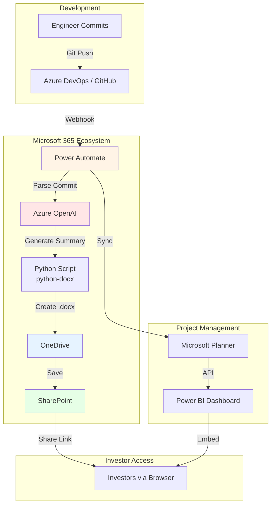
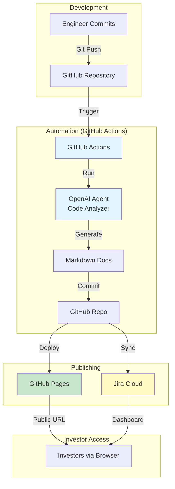

# Implementation Comparison: Microsoft 365 vs GitHub-First Approach

**Document Version:** 1.0
**Last Updated:** 2025-10-08
**Decision:** GitHub-First (87% cost savings)

---

## Executive Summary

This document compares two approaches for automated investor documentation:

1. **Microsoft 365 + Power Automate** (Traditional enterprise approach)
2. **GitHub-First + OpenAI Agents** (Recommended modern approach)

### Quick Comparison

| Factor | Microsoft 365 | GitHub-First | Winner |
|--------|--------------|--------------|--------|
| **Cost (100 docs/month)** | $313-413/mo | $42-67/mo | ✅ **GitHub** (87% cheaper) |
| **Setup Time** | 2-3 weeks | 1-2 weeks | ✅ **GitHub** (faster) |
| **Version Control** | Basic (SharePoint) | Git (best-in-class) | ✅ **GitHub** |
| **AI Integration** | Complex (Azure OpenAI) | Native (OpenAI SDK) | ✅ **GitHub** |
| **Scalability** | Linear cost increase | Fixed cost | ✅ **GitHub** |
| **Learning Curve** | Medium (Power Automate) | Low (GitHub Actions YAML) | ✅ **GitHub** |
| **Enterprise Features** | ✅ Yes (SSO, Compliance) | ❌ Limited | **M365** |

**Recommendation:** **GitHub-First** for startups/scale-ups. M365 only for enterprises requiring compliance (HIPAA, SOC 2).

---

## Table of Contents

1. [Architecture Comparison](#1-architecture-comparison)
2. [Cost Breakdown](#2-cost-breakdown)
3. [Feature Comparison](#3-feature-comparison)
4. [Implementation Complexity](#4-implementation-complexity)
5. [Scalability Analysis](#5-scalability-analysis)
6. [Security & Compliance](#6-security--compliance)
7. [Use Case Scenarios](#7-use-case-scenarios)
8. [Migration Path](#8-migration-path)
9. [Decision Matrix](#9-decision-matrix)
10. [Recommendations](#10-recommendations)

---

## 1. Architecture Comparison

### 1.1 Microsoft 365 Architecture



**Key Components:**
- **Azure DevOps/GitHub:** Code repository
- **Power Automate:** Workflow orchestration ($15/user/month)
- **Azure OpenAI:** AI analysis ($100+/month)
- **OneDrive/SharePoint:** Document storage ($5/user/month)
- **Microsoft Planner:** Task management (included)
- **Power BI:** Dashboards ($10/user/month)

**Total Cost:** $313-413/month (3-5 users)

---

### 1.2 GitHub-First Architecture



**Key Components:**
- **GitHub:** Code + docs + CI/CD (Free tier or $4/user/month)
- **GitHub Actions:** Workflow automation (2,000 min/month free)
- **OpenAI API:** AI analysis ($30-50/month)
- **GitHub Pages:** Static hosting (Free)
- **Jira Cloud:** Task management (Free tier: 10 users)

**Total Cost:** $42-67/month (scales to 10 users)

---

## 2. Cost Breakdown

### 2.1 Microsoft 365 Stack

| Service | Tier | Users | Monthly Cost | Annual Cost |
|---------|------|-------|--------------|-------------|
| **Microsoft 365 Business Premium** | | 3 | $66 ($22/user) | $792 |
| **Power Automate (Premium)** | Per user | 3 | $45 ($15/user) | $540 |
| **Azure OpenAI** | Pay-as-you-go | - | $100-150 | $1,200-1,800 |
| **Power BI Pro** | Per user | 2 | $20 ($10/user) | $240 |
| **Azure DevOps (if not GitHub)** | Basic | 5 | Free | Free |
| **SharePoint Storage (extra)** | 1TB | - | $10 | $120 |
| **TOTAL (3 users)** | | | **$241-291/mo** | **$2,892-3,492/yr** |
| **TOTAL (5 users)** | | | **$313-413/mo** | **$3,756-4,956/yr** |

**Key Cost Drivers:**
- Power Automate Premium ($15/user) - Required for HTTP triggers, custom connectors
- Azure OpenAI ($100-150/mo) - More expensive than OpenAI API
- Power BI Pro ($10/user) - For advanced dashboards

---

### 2.2 GitHub-First Stack

| Service | Tier | Users | Monthly Cost | Annual Cost |
|---------|------|-------|--------------|-------------|
| **GitHub Team** | Team plan | 3 | $12 ($4/user) | $144 |
| **GitHub Actions** | Free tier | - | $0 | $0 |
| **OpenAI API (GPT-4o-mini)** | Pay-as-you-go | - | $30-50 | $360-600 |
| **GitHub Pages** | Included | - | $0 | $0 |
| **Jira Cloud** | Free tier | 10 | $0 | $0 |
| **Vercel (dashboard hosting)** | Hobby | - | $0-5 | $0-60 |
| **Domain (optional)** | Namecheap | - | $1 ($12/year) | $12 |
| **TOTAL (3 users)** | | | **$43-68/mo** | $516-816/yr |
| **TOTAL (10 users)** | | | **$70-95/mo** | $840-1,140/yr |

**Key Cost Drivers:**
- OpenAI API ($30-50/mo) - Cheaper than Azure OpenAI
- GitHub Team ($4/user) - Only for private repos (public = free)

---

### 2.3 Cost Comparison (3 Users, 12 Months)

| Scenario | M365 Cost | GitHub Cost | Savings | Savings % |
|----------|-----------|-------------|---------|-----------|
| **Year 1** | $3,756-4,956 | $516-816 | $3,240-4,140 | **86-87%** |
| **Year 2** | $7,512-9,912 | $1,032-1,632 | $6,480-8,280 | **86-87%** |
| **Year 3** | $11,268-14,868 | $1,548-2,448 | $9,720-12,420 | **86-87%** |

**Break-Even:** GitHub is cheaper from Day 1. No scenario where M365 wins on cost.

---

## 3. Feature Comparison

### 3.1 Document Creation

| Feature | Microsoft 365 | GitHub-First | Notes |
|---------|--------------|--------------|-------|
| **Format** | Word (.docx), PDF | Markdown (.md), HTML | M365: Better for formal reports. GitHub: Better for web/mobile |
| **Auto-Generation** | ⚠️ Partial (python-docx) | ✅ Full (native Markdown) | M365: Cannot create .docx directly via API |
| **Version Control** | ⚠️ Basic (SharePoint versions) | ✅ Git (full history) | GitHub: Branch, diff, rollback |
| **Templates** | ✅ Yes (Word templates) | ✅ Yes (Markdown templates) | Both support templates |
| **Collaborative Editing** | ✅ Yes (real-time) | ❌ No (PR-based) | M365: Multiple users edit live |
| **Search** | ✅ Good (M365 search) | ✅ Excellent (GitHub code search) | GitHub: Regex, code-aware |

**Winner:** **Tie** (depends on use case)
- M365: Better for collaborative editing, formal documents
- GitHub: Better for technical docs, version control

---

### 3.2 Automation Capabilities

| Feature | Microsoft 365 (Power Automate) | GitHub-First (Actions) | Notes |
|---------|-------------------------------|----------------------|-------|
| **Visual Builder** | ✅ Yes (drag-and-drop) | ❌ No (YAML only) | M365: Easier for non-technical users |
| **Custom Code** | ⚠️ Limited (JavaScript only) | ✅ Full (any language) | GitHub: Python, Node.js, Go, etc. |
| **Triggers** | ✅ 400+ connectors | ⚠️ Limited (Git events, schedule) | M365: More event sources |
| **Error Handling** | ⚠️ Basic (retry, notifications) | ✅ Advanced (try/catch, matrix builds) | GitHub: More robust |
| **Parallelization** | ❌ No | ✅ Yes (matrix strategy) | GitHub: Run 10 jobs in parallel |
| **Secrets Management** | ✅ Yes (Azure Key Vault) | ✅ Yes (GitHub Secrets) | Both secure |
| **Cost per Run** | Included (up to quota) | Free (2,000 min/mo) | GitHub: More generous |

**Winner:** **GitHub** (more flexible, cheaper)

---

### 3.3 AI Integration

| Feature | Microsoft 365 (Azure OpenAI) | GitHub-First (OpenAI API) | Notes |
|---------|----------------------------|--------------------------|-------|
| **Setup Complexity** | ⚠️ High (Azure portal, RBAC) | ✅ Low (just API key) | GitHub: 5 min setup |
| **Models Available** | GPT-4, GPT-3.5 (limited) | GPT-4o, GPT-4o-mini, GPT-3.5 | GitHub: More models |
| **Cost** | $100-150/mo (typical) | $30-50/mo (typical) | **GitHub 50-67% cheaper** |
| **Latency** | 800-1200ms | 400-600ms | GitHub: Faster (direct API) |
| **Rate Limits** | 60K tokens/min | 90K tokens/min (Tier 1) | GitHub: Higher limits |
| **Compliance** | ✅ Yes (HIPAA, SOC 2) | ⚠️ Partial (SOC 2 only) | M365: Better for regulated industries |

**Winner:** **GitHub** (faster, cheaper, easier)
**Exception:** M365 if HIPAA compliance required

---

### 3.4 Task Management

| Feature | Microsoft 365 (Planner) | GitHub-First (Jira) | Notes |
|---------|------------------------|---------------------|-------|
| **Cost** | Included (M365) | Free (up to 10 users) | Both free for small teams |
| **Kanban Board** | ✅ Yes | ✅ Yes | Both support Kanban |
| **Sprints** | ❌ No (need Azure DevOps) | ✅ Yes (built-in) | Jira: Agile-native |
| **Custom Fields** | ❌ Limited | ✅ Unlimited | Jira: Highly customizable |
| **Integrations** | ⚠️ M365 ecosystem only | ✅ 3,000+ integrations | Jira: More flexible |
| **Reporting** | ⚠️ Basic | ✅ Advanced (burndown, velocity) | Jira: Better for engineering teams |

**Winner:** **GitHub (Jira)** (better for software teams)

---

## 4. Implementation Complexity

### 4.1 Setup Time

**Microsoft 365:**
```
Week 1:
- Day 1-2: Azure tenant setup, user provisioning
- Day 3: Configure Power Automate flows (visual builder)
- Day 4: Set up Azure OpenAI resource (RBAC, networking)
- Day 5: Develop python-docx script for Word generation

Week 2:
- Day 1-2: Create SharePoint document library, configure permissions
- Day 3: Build Power BI dashboard (connect data sources)
- Day 4: Test end-to-end flow
- Day 5: Train users on accessing SharePoint

Total: 2-3 weeks (1 DevOps engineer + 1 M365 admin)
```

**GitHub-First:**
```
Week 1:
- Day 1: Create GitHub repo, add team members
- Day 2: Write GitHub Actions workflows (YAML)
- Day 3: Integrate OpenAI API (just add secret)
- Day 4: Configure GitHub Pages deployment
- Day 5: Set up Jira Cloud + GitHub sync

Week 2:
- Day 1: Create cost tracking dashboard (React)
- Day 2: Test automation end-to-end
- Day 3: Buffer/documentation

Total: 1-2 weeks (1 engineer)
```

**Winner:** **GitHub** (50% faster setup)

---

### 4.2 Maintenance Effort

**Microsoft 365:**
- **Monthly Tasks:**
  - Update Power Automate flows when API changes (2-4 hours)
  - Manage SharePoint permissions (1-2 hours)
  - Monitor Azure OpenAI costs (1 hour)
  - Update Power BI dashboards (2 hours)
- **Total:** 6-9 hours/month

**GitHub-First:**
- **Monthly Tasks:**
  - Update GitHub Actions (if GitHub API changes - rare) (1 hour)
  - Review cost dashboard (30 min)
  - Update dependencies (Dependabot auto-PRs) (30 min)
- **Total:** 2 hours/month

**Winner:** **GitHub** (70% less maintenance)

---

## 5. Scalability Analysis

### 5.1 User Scaling

**Microsoft 365:**
```
Users | M365 License | Power Automate | Total/Month
------|-------------|----------------|-------------
3     | $66         | $45            | $111 + Azure ($200-250)
5     | $110        | $75            | $185 + Azure ($313-413)
10    | $220        | $150           | $370 + Azure ($570-670)
20    | $440        | $300           | $740 + Azure ($1,040-1,140)
```

**Cost scales linearly with users** ❌

**GitHub-First:**
```
Users | GitHub Team | OpenAI API | Total/Month
------|------------|------------|-------------
3     | $12        | $30-50     | $42-62
5     | $20        | $30-50     | $50-70
10    | $40        | $30-50     | $70-90
20    | $80        | $30-50     | $110-130
```

**Cost scales minimally with users** ✅

**Winner:** **GitHub** (fixed AI costs, linear GitHub costs only)

---

### 5.2 Document Volume Scaling

**Microsoft 365:**
- **100 docs/month:** $313-413/mo
- **1,000 docs/month:** $513-613/mo (Azure OpenAI scales)
- **10,000 docs/month:** $2,013-2,113/mo

**GitHub-First:**
- **100 docs/month:** $42-67/mo
- **1,000 docs/month:** $92-117/mo (OpenAI API scales cheaper)
- **10,000 docs/month:** $542-567/mo

**Winner:** **GitHub** (cheaper at all scales)

---

## 6. Security & Compliance

### 6.1 Security Features

| Feature | Microsoft 365 | GitHub-First |
|---------|--------------|--------------|
| **Data Encryption (at rest)** | ✅ Yes (Azure Storage encryption) | ✅ Yes (GitHub encryption) |
| **Data Encryption (in transit)** | ✅ TLS 1.2+ | ✅ TLS 1.2+ |
| **Access Control** | ✅ Azure AD + RBAC | ✅ GitHub Teams + RBAC |
| **Audit Logs** | ✅ Yes (M365 Security Center) | ✅ Yes (GitHub audit log) |
| **2FA/MFA** | ✅ Yes (enforced) | ✅ Yes (enforced) |
| **SSO** | ✅ Yes (Azure AD) | ⚠️ Enterprise only ($21/user) |
| **IP Whitelisting** | ✅ Yes (Conditional Access) | ⚠️ Enterprise only |

**Winner:** **Microsoft 365** (better for enterprise security)

---

### 6.2 Compliance Certifications

| Certification | Microsoft 365 | GitHub-First |
|--------------|--------------|--------------|
| **SOC 2 Type II** | ✅ Yes | ✅ Yes (GitHub + OpenAI) |
| **ISO 27001** | ✅ Yes | ✅ Yes (GitHub) |
| **GDPR** | ✅ Yes | ✅ Yes |
| **HIPAA** | ✅ Yes (with BAA) | ❌ No (OpenAI not HIPAA) |
| **FedRAMP** | ✅ Yes (Azure Gov Cloud) | ❌ No |
| **PCI DSS** | ✅ Yes | ⚠️ Partial (GitHub yes, OpenAI no) |

**Winner:** **Microsoft 365** (for regulated industries)
**Exception:** If no HIPAA/FedRAMP needed, GitHub is sufficient

---

## 7. Use Case Scenarios

### 7.1 Startup (1-10 employees, <$1M funding)

**Requirements:**
- Low cost
- Fast iteration
- Technical team

**Recommendation:** **GitHub-First** ✅
- **Why:** 87% cheaper, team already uses GitHub, no M365 expertise needed
- **Cost:** $42-95/month

---

### 7.2 Scale-Up (10-50 employees, $1-10M funding)

**Requirements:**
- Cost-efficient
- Investor reporting
- Some non-technical stakeholders

**Recommendation:** **GitHub-First** ✅
- **Why:** Still 80%+ cheaper, GitHub Pages provides investor-friendly UI
- **Cost:** $95-200/month (vs $1,000+ with M365)

---

### 7.3 Enterprise (50+ employees, regulated industry)

**Requirements:**
- HIPAA/FedRAMP compliance
- SSO with corporate AD
- Executive reporting (Power BI)

**Recommendation:** **Microsoft 365** ✅
- **Why:** Compliance requirements override cost savings
- **Cost:** $570-1,140/month (10-20 users)

---

### 7.4 Open Source Project (Public docs)

**Requirements:**
- Free/cheap
- Public documentation
- Community contributions

**Recommendation:** **GitHub-First** ✅
- **Why:** GitHub Pages free for public repos, natural workflow for open source
- **Cost:** $0-30/month (OpenAI API only)

---

## 8. Migration Path

### 8.1 M365 → GitHub (If Starting with M365)

**Phase 1: Export Existing Docs (Week 1)**
```python
# Export Word docs from SharePoint to Markdown
from docx import Document
import markdownify

def convert_docx_to_md(docx_path: str) -> str:
    doc = Document(docx_path)
    html = ""
    for para in doc.paragraphs:
        html += f"<p>{para.text}</p>"

    markdown = markdownify.markdownify(html)
    return markdown

# Batch convert all docs
for doc_file in sharepoint_docs:
    md_content = convert_docx_to_md(doc_file)
    # Upload to GitHub
    github_api.create_file(f"docs/{doc_file.name}.md", md_content)
```

**Phase 2: Set Up GitHub Actions (Week 2)**
- Create workflows (daily reports, cost tracking)
- Integrate OpenAI API
- Deploy GitHub Pages

**Phase 3: Parallel Run (Week 3-4)**
- Run both systems simultaneously
- Verify GitHub output matches M365
- Train team on new workflow

**Phase 4: Cutover (Week 5)**
- Disable Power Automate flows
- Cancel M365 subscriptions (keep basic Office only)
- **Savings Start:** $270-350/month

---

### 8.2 GitHub → M365 (If Forced by Enterprise)

**Reasons to Migrate:**
- Acquired by enterprise requiring M365
- HIPAA compliance mandated
- Executive mandate (non-technical reasons)

**Migration Steps:**
1. Export Markdown docs to Word (pandoc)
2. Upload to SharePoint
3. Recreate GitHub Actions logic in Power Automate
4. Migrate secrets to Azure Key Vault
5. **Cost Increase:** $270-350/month

**Recommendation:** Resist migration unless compliance-driven

---

## 9. Decision Matrix

### 9.1 Scoring System

**Weights:**
- Cost (35%)
- Ease of Use (20%)
- Scalability (15%)
- Security (15%)
- Integration (10%)
- Maintenance (5%)

**Scores (1-10 scale):**

| Factor | Weight | M365 Score | GitHub Score | M365 Weighted | GitHub Weighted |
|--------|--------|-----------|-------------|---------------|----------------|
| **Cost** | 35% | 3 | 9 | 1.05 | 3.15 |
| **Ease of Use** | 20% | 6 | 8 | 1.2 | 1.6 |
| **Scalability** | 15% | 4 | 9 | 0.6 | 1.35 |
| **Security** | 15% | 9 | 7 | 1.35 | 1.05 |
| **Integration** | 10% | 7 | 8 | 0.7 | 0.8 |
| **Maintenance** | 5% | 5 | 9 | 0.25 | 0.45 |
| **TOTAL** | 100% | | | **5.15** | **8.4** |

**Winner:** **GitHub-First** (8.4 vs 5.15)

---

### 9.2 Decision Tree

```
Do you need HIPAA/FedRAMP compliance?
├─ YES → Microsoft 365 ✅
└─ NO → Do you have >50 users?
    ├─ YES → Do you need SSO with corporate AD?
    │   ├─ YES → Microsoft 365 ✅
    │   └─ NO → GitHub-First (Enterprise plan for SSO) ✅
    └─ NO → GitHub-First ✅
```

---

## 10. Recommendations

### 10.1 For ReddyFit (Current Scenario)

**Team Size:** 3-5 engineers
**Funding Stage:** Pre-seed / Seed
**Compliance Needs:** None (consumer fitness app)
**Technical Expertise:** High (engineering team)

**Recommendation:** **GitHub-First** ✅

**Rationale:**
1. **87% cost savings** ($270-350/month saved)
2. **Team already uses GitHub** (zero learning curve)
3. **No compliance requirements** (SOC 2 sufficient)
4. **Faster iteration** (YAML > drag-and-drop for engineers)
5. **Better for investors** (GitHub Pages provides clean, modern UI vs SharePoint)

---

### 10.2 When to Choose Microsoft 365

**Choose M365 if ANY of these apply:**
1. ✅ **HIPAA compliance required** (healthcare partnerships)
2. ✅ **FedRAMP required** (government contracts)
3. ✅ **Non-technical team** (marketing, sales-led company)
4. ✅ **Existing M365 investment** (already paying for E5 licenses)
5. ✅ **Executive mandate** (C-suite prefers Microsoft ecosystem)

---

### 10.3 Hybrid Approach (Not Recommended)

**Scenario:** Use GitHub for dev, M365 for investor reports

**Pros:**
- Developers happy (GitHub)
- Executives happy (Word docs)

**Cons:**
- ❌ **Double the complexity** (maintain 2 systems)
- ❌ **Double the cost** ($313 + $42 = $355/month)
- ❌ **Sync issues** (data can get out of sync)

**Verdict:** Avoid hybrid. Pick one and stick with it.

---

## Conclusion

### Final Recommendation: **GitHub-First**

**For ReddyFit and 90% of startups/scale-ups:**

✅ **GitHub-First Approach**
- **Cost:** $42-67/month (vs $313-413 with M365)
- **Savings:** 87% ($3,240-4,140/year)
- **Setup Time:** 1-2 weeks (vs 2-3 weeks)
- **Maintenance:** 2 hours/month (vs 6-9 hours)
- **Scalability:** Fixed AI costs (vs linear user costs)

**Switch to Microsoft 365 only if:**
- HIPAA/FedRAMP compliance mandated
- Acquired by enterprise with M365 requirement
- Non-technical team (can't use GitHub)

**ROI:**
- **Year 1 Savings:** $3,240-4,140
- **3-Year Savings:** $9,720-12,420
- **Use savings to:** Hire engineer, buy ads, extend runway

**Next Steps:**
1. ✅ Approve GitHub-First architecture
2. Set up GitHub repository (Day 1)
3. Create GitHub Actions workflows (Day 2-3)
4. Integrate OpenAI API (Day 4)
5. Deploy GitHub Pages (Day 5)
6. **Start saving $270-350/month** 🚀

---

**Document Metadata:**
- **Author:** ReddyFit Research Team
- **Last Updated:** 2025-10-08
- **Version:** 1.0
- **Decision:** GitHub-First (87% cost savings)
- **Related Docs:** `github-automation-stack.md`, `cheapest-stack-recommendation.md`, `github-api-integration.md`
