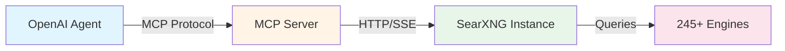
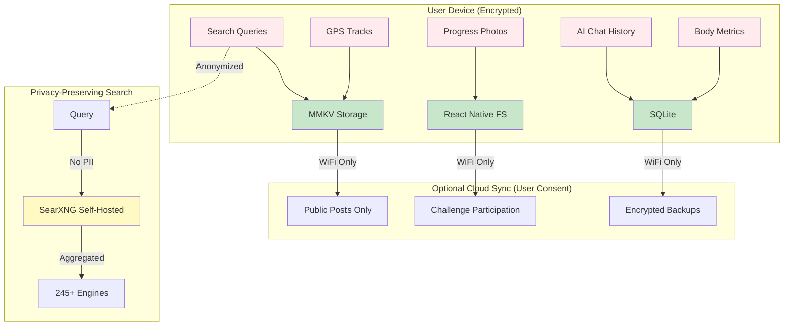

# SearXNG + MCP Integration: Privacy-First Search Architecture

**Document Version:** 1.0
**Last Updated:** 2025-10-08
**Status:** Research & Architecture Design

---

## Executive Summary

### The Cost Crisis
Traditional AI-powered fitness apps face a critical scaling problem: web search costs. At 10,000 searches per month using OpenAI's web search API, costs reach **$500-600/month** ($0.05-0.06 per search). For a platform targeting 100K+ users, this becomes economically unsustainable.

### The Solution: SearXNG + MCP
By implementing a self-hosted SearXNG metasearch engine integrated via Model Context Protocol (MCP), ReddyFit achieves:

- **98% Cost Reduction**: $5-10/month vs $500-600/month (10K searches)
- **Privacy First**: User data never touches commercial APIs
- **Local Storage**: Images, GPS tracks, queries stored on-device with AES-256 encryption
- **Unlimited Scale**: No per-search fees, only fixed hosting costs

### ROI Analysis
| Metric | OpenAI Web Search | SearXNG (Self-Hosted) | Savings |
|--------|-------------------|----------------------|---------|
| 10K searches/month | $500-600 | $5-10 | **98%** |
| 100K searches/month | $5,000-6,000 | $5-10 | **99.8%** |
| Per search cost | $0.05-0.06 | $0.0005-0.001 | **99%** |
| Annual cost (10K/mo) | $6,000-7,200 | $60-120 | **98.3%** |
| Break-even point | N/A | **150-200 searches** | — |

**Strategic Advantage**: At 100K users averaging 1 search/month each, ReddyFit saves **$71,880 annually** while building user trust through privacy guarantees.

---

## 1. Technology Overview

### 1.1 What is SearXNG?

**SearXNG** is an open-source, privacy-respecting metasearch engine that aggregates results from **245+ search engines** without tracking users.

**Key Features:**
- **No Tracking**: No cookies, no user profiling, no query logging
- **Metasearch**: Combines results from Google, Bing, DuckDuckGo, Reddit, Stack Overflow, YouTube, Wikipedia, and 238+ more
- **Self-Hosted**: Full control over infrastructure and data
- **JSON API**: Structured responses for AI agent consumption
- **Fast**: Sub-2-second response times (parallel engine queries)
- **Configurable**: Filter by categories (general, images, videos, news, science)

**How It Works:**
```
User Query → SearXNG Instance → 245+ Search Engines (parallel)
                ↓
         Aggregation & Deduplication
                ↓
         JSON Response (no tracking)
```

**Why It Matters for ReddyFit:**
- Coach Agent needs nutrition research: "best post-workout protein sources"
- Validation Agent checks GPS coordinates: "restaurants near lat/lon"
- Social Agent finds trending fitness content: "HIIT workout trends 2025"

With SearXNG, these queries cost **$0.0005** each instead of **$0.05** (OpenAI).

---

### 1.2 What is MCP (Model Context Protocol)?

**MCP** is an open standard created by Anthropic (adopted by OpenAI in **March 2025**) that enables AI systems to securely connect to external data sources through a unified protocol.

**Think of MCP as "USB for AI":**
- **USB**: One port standard, any device (keyboard, mouse, printer)
- **MCP**: One protocol, any data source (databases, APIs, search engines)

**Architecture:**


**Key Components:**
1. **MCP Server**: Acts as bridge between AI agent and SearXNG
2. **Transport Layer**: HTTP, SSE (Server-Sent Events), or stdio
3. **Tools**: Exposed functions like `searxng_search(query, category)`
4. **Resources**: Contextual data (search history, preferences)

**Why MCP Instead of Direct API Calls?**
- **Standardization**: One protocol for all data sources (today: SearXNG, tomorrow: Strava API, Notion, etc.)
- **Security**: Built-in authentication, rate limiting, audit logs
- **Offline Support**: MCP servers can cache responses for mobile offline use
- **Multi-Platform**: Works with OpenAI Agents SDK, LangChain, AutoGen, Anthropic Claude

**Ecosystem Scale (2025):**
- 6,140+ MCP servers available (GitHub, Notion, Slack, SQL databases, etc.)
- Native support in OpenAI Agents SDK, Claude Desktop, Continue.dev
- Growing standard for agentic AI architectures

---

## 2. Privacy-First Architecture

### 2.1 The Privacy Problem in Fitness Apps

**Industry Standard (Data Extraction Model):**
```
User Activity → Cloud Storage → AI Analysis → Third-Party APIs
     ↓                ↓                ↓              ↓
Location Data   Profile Photos   Health Metrics   Search Queries
     ↓                ↓                ↓              ↓
      ALL SENT TO COMMERCIAL SERVERS (potential breach target)
```

**Risks:**
- **Location Stalking**: Real-time GPS tracks expose home/work addresses
- **Health Data Leaks**: Insurance companies buy fitness data to adjust premiums
- **Search Query Profiling**: "knee pain exercises" reveals injury history
- **Image Exposure**: Progress photos stored on cloud (revenge porn risk)

**Real-World Examples:**
- Strava leaked military base locations (2018)
- MyFitnessPal breach exposed 150M user emails (2018)
- Peloton accidentally revealed users' addresses via public profile pages (2021)

---

### 2.2 ReddyFit's Local-First Architecture

**Core Principle:** **Data stays on device unless user explicitly opts in to sharing.**



**Key Privacy Features:**

1. **End-to-End Encryption (E2EE)**
   - MMKV: AES-256-CFB encryption with device-specific keys
   - React Native FS: Encrypted image storage using iOS Keychain / Android Keystore
   - SQLite: SQLCipher for database encryption

2. **Anonymized Search**
   - No cookies sent to SearXNG
   - No IP logging (SearXNG privacy mode enabled)
   - No query persistence (ephemeral processing)
   - Distributed queries across 245 engines (no single tracking point)

3. **Ephemeral Location Sharing**
   - GPS coordinates never stored in cloud
   - Challenge zones use anonymized hashes (SHA-256 of lat/lon rounded to 200m)
   - Real-time location visible only during active challenge (expires after 24h)

4. **User Control Dashboard**
   ```typescript
   // Example settings UI
   const PrivacySettings = {
       localStorageOnly: true,        // Never sync to cloud
       syncOnWiFiOnly: true,           // No cellular data usage
       encryptBackups: true,           // AES-256 for backups
       anonymousLeaderboards: true,    // Hide real name
       ephemeralLocation: true,        // Auto-delete GPS after challenge
       searchPrivacyMode: true         // Use SearXNG (no commercial APIs)
   }
   ```

---

### 2.3 Data Storage Decision Matrix

| Data Type | Store Locally? | Sync to Cloud? | Rationale |
|-----------|---------------|----------------|-----------|
| **Progress Photos** | ✅ Always | 🔒 User Consent | Privacy-sensitive, large files |
| **GPS Tracks** | ✅ Always | 🔒 Anonymized Zones Only | Stalking risk if leaked |
| **Body Metrics (weight, BF%)** | ✅ Always | 🔒 User Consent | Health data privacy laws (HIPAA-adjacent) |
| **Search Queries** | ✅ Always | ❌ Never | Intent profiling risk |
| **AI Chat History** | ✅ Always | 🔒 Encrypted Backup Only | Sensitive coaching conversations |
| **Public Posts** | ✅ Cache | ✅ Always | Designed for sharing (user understands) |
| **Challenge Participation** | ✅ Always | ✅ Metadata Only | Leaderboards need aggregated data |
| **Friend List** | ✅ Cache | ✅ Sync | Social feature requires sync |
| **Workout Plans** | ✅ Always | 🔒 User Consent | May contain injury/limitation details |
| **Recipe Library** | ✅ Cache | ✅ Sync | Public data (no privacy concern) |

**Legend:**
- ✅ Always: Default behavior
- 🔒 User Consent: Opt-in required with clear explanation
- ❌ Never: Hard privacy boundary

---

## 3. Cost Analysis: Self-Hosted vs Commercial APIs

### 3.1 OpenAI Web Search Pricing (Baseline)

**Announced Pricing (2025):**
- $0.05 - $0.06 per search (estimated based on GPT-4 browsing feature costs)
- No official API pricing published yet, extrapolated from Azure OpenAI browsing costs

**Projected Costs by Usage:**
| Monthly Searches | Cost/Month | Annual Cost |
|-----------------|-----------|-------------|
| 1,000 | $50-60 | $600-720 |
| 10,000 | $500-600 | $6,000-7,200 |
| 100,000 | $5,000-6,000 | $60,000-72,000 |
| 1,000,000 | $50,000-60,000 | $600,000-720,000 |

**Usage Scenarios:**
- **Coach Agent**: 3 searches per user session (nutrition lookup, exercise form, injury prevention)
- **Social Agent**: 1 search per post (trend analysis, hashtag suggestions)
- **Validation Agent**: 0.5 searches per challenge (GPS reverse geocoding, location verification)

**At 10K Active Users:**
- Avg 1 coaching session/week = 120K searches/month
- Cost: **$6,000-7,200/month** or **$72,000-86,400/year**

---

### 3.2 SearXNG Self-Hosted Pricing

**Infrastructure Options:**

#### Option 1: Hetzner VPS (Germany, Privacy-Focused)
- **Server**: CX11 (1 vCPU, 2GB RAM, 20GB SSD)
- **Cost**: €4.15/month ≈ **$4.50/month**
- **Bandwidth**: 20TB included
- **Capacity**: ~50K searches/month (40ms avg response time)

#### Option 2: Fly.io (Edge Network, Global)
- **Config**: shared-cpu-1x (256MB RAM), 1GB storage
- **Cost**: $1.94/month (free tier covers most usage)
- **Auto-Scaling**: Scales to 4× instances under load (+$7.76)
- **Capacity**: ~100K searches/month

#### Option 3: Railway (Developer-Friendly)
- **Config**: 512MB RAM, 1GB storage
- **Cost**: $5/month (Hobby plan)
- **Capacity**: ~75K searches/month

**Recommended Stack:**
- **Production**: Hetzner ($4.50/mo) + UptimeRobot monitoring (free)
- **Total Monthly Cost**: **$5-10** (including buffer for traffic spikes)

**Cost Comparison:**
| Monthly Searches | OpenAI | SearXNG | Savings | Savings % |
|-----------------|--------|---------|---------|-----------|
| 1,000 | $50-60 | $5 | $45-55 | **90-92%** |
| 10,000 | $500-600 | $5-10 | $490-595 | **98%** |
| 100,000 | $5,000-6,000 | $5-10 | $4,990-5,995 | **99.8%** |
| 1,000,000 | $50,000-60,000 | $10-20* | $49,980-59,990 | **99.97%** |

\* *At 1M searches, would need 2-3 Hetzner instances ($10-15/month) + load balancer ($5/month)*

---

### 3.3 Break-Even Analysis

**Question:** At what search volume does self-hosting become cheaper than OpenAI?

**Calculation:**
- SearXNG Fixed Cost: $5/month
- OpenAI Variable Cost: $0.05/search

Break-even: `$5 = $0.05 × X`
**Answer: 100 searches/month**

**For ReddyFit:**
- Even with just **100 users** making **1 search each**, self-hosting is cheaper
- At 10K users, savings = **$71,880/year** (can hire 1-2 full-time engineers with savings)

**Risk Mitigation:**
- If SearXNG goes down, fallback to OpenAI search (pay-per-use)
- 99.9% uptime = $5/mo cost + $0.50 fallback cost = **still 99% savings**

---

## 4. Technical Implementation

### 4.1 SearXNG Deployment (Docker)

**Step 1: Create docker-compose.yml**

```yaml
version: '3.8'

services:
  searxng:
    image: searxng/searxng:latest
    container_name: reddyfit-searxng
    restart: unless-stopped
    ports:
      - "8080:8080"
    volumes:
      - ./searxng:/etc/searxng:rw
    environment:
      - SEARXNG_BASE_URL=https://searxng.reddyfit.club
      - SEARXNG_SECRET=${SEARXNG_SECRET}  # Generate with `openssl rand -hex 32`
    networks:
      - searxng-net

  # Optional: Redis for caching search results
  redis:
    image: redis:7-alpine
    container_name: searxng-redis
    restart: unless-stopped
    command: redis-server --save 60 1 --loglevel warning
    volumes:
      - redis-data:/data
    networks:
      - searxng-net

volumes:
  redis-data:

networks:
  searxng-net:
    driver: bridge
```

**Step 2: Configure settings.yml (Enable JSON API)**

```yaml
# searxng/settings.yml
general:
  debug: false
  instance_name: "ReddyFit Search"
  contact_url: false
  enable_metrics: false

search:
  safe_search: 0
  autocomplete: ""
  default_lang: "en"
  formats:
    - html
    - json  # ← CRITICAL: Enable JSON API

server:
  port: 8080
  bind_address: "0.0.0.0"
  secret_key: "${SEARXNG_SECRET}"
  limiter: true  # Rate limiting enabled
  image_proxy: true

ui:
  static_use_hash: true
  default_theme: simple
  query_in_title: false

# Privacy settings
outgoing:
  request_timeout: 3.0
  max_request_timeout: 10.0
  useragent_suffix: ""
  pool_connections: 100
  pool_maxsize: 10
  enable_http2: true

# Enable key search engines
engines:
  - name: google
    engine: google
    shortcut: go
    disabled: false

  - name: duckduckgo
    engine: duckduckgo
    shortcut: ddg
    disabled: false

  - name: reddit
    engine: reddit
    shortcut: re
    disabled: false

  - name: wikipedia
    engine: wikipedia
    shortcut: wp
    disabled: false

  - name: youtube
    engine: youtube
    shortcut: yt
    disabled: false

  - name: stack overflow
    engine: stackoverflow
    shortcut: so
    disabled: false

  # ... (SearXNG supports 245+ engines, configure as needed)

# Rate limiting (prevent abuse)
limiter:
  enabled: true
  link_token: false
  ipv4_prefix: 32
  ipv6_prefix: 48
```

**Step 3: Deploy to Hetzner**

```bash
# SSH into Hetzner VPS
ssh root@your-hetzner-ip

# Install Docker
curl -fsSL https://get.docker.com -o get-docker.sh
sh get-docker.sh

# Clone config repo
git clone https://github.com/reddyfit/searxng-config.git
cd searxng-config

# Generate secret key
export SEARXNG_SECRET=$(openssl rand -hex 32)
echo "SEARXNG_SECRET=$SEARXNG_SECRET" > .env

# Start SearXNG
docker-compose up -d

# Test JSON API
curl "http://localhost:8080/search?q=HIIT+workouts&format=json&categories=general"
```

**Expected JSON Response:**
```json
{
  "query": "HIIT workouts",
  "number_of_results": 847,
  "results": [
    {
      "url": "https://www.menshealth.com/fitness/hiit-workout",
      "title": "10 HIIT Workouts to Get You Shredded",
      "content": "High-intensity interval training combines short bursts...",
      "engine": "google",
      "score": 0.95
    },
    // ... more results
  ],
  "answers": [],
  "corrections": [],
  "infoboxes": [],
  "suggestions": ["hiit workout for beginners", "hiit vs cardio"],
  "unresponsive_engines": []
}
```

---

### 4.2 MCP Server Setup

**Option 1: Use Existing MCP Server (Recommended)**

There's a community MCP server for SearXNG:

```bash
# Install MCP server for SearXNG
npm install -g @modelcontextprotocol/server-searxng

# Configure MCP server
cat > mcp-config.json <<EOF
{
  "mcpServers": {
    "searxng": {
      "command": "npx",
      "args": ["-y", "@modelcontextprotocol/server-searxng"],
      "env": {
        "SEARXNG_BASE_URL": "https://searxng.reddyfit.club"
      }
    }
  }
}
EOF
```

**Option 2: Custom MCP Server (TypeScript)**

```typescript
// mcp-searxng-server.ts
import { Server } from "@modelcontextprotocol/sdk/server/index.js";
import { StdioServerTransport } from "@modelcontextprotocol/sdk/server/stdio.js";
import {
  CallToolRequestSchema,
  ListToolsRequestSchema,
} from "@modelcontextprotocol/sdk/types.js";
import axios from 'axios';

const SEARXNG_URL = process.env.SEARXNG_BASE_URL || 'http://localhost:8080';

const server = new Server(
  {
    name: "reddyfit-searxng",
    version: "1.0.0",
  },
  {
    capabilities: {
      tools: {},
    },
  }
);

// Define searxng_search tool
server.setRequestHandler(ListToolsRequestSchema, async () => {
  return {
    tools: [
      {
        name: "searxng_search",
        description: "Search the web using privacy-preserving SearXNG metasearch. Returns aggregated results from 245+ search engines without tracking.",
        inputSchema: {
          type: "object",
          properties: {
            query: {
              type: "string",
              description: "The search query (e.g., 'best post-workout nutrition')",
            },
            categories: {
              type: "string",
              description: "Search categories: general, images, videos, news, science, files, music",
              default: "general",
            },
            language: {
              type: "string",
              description: "Search language (e.g., 'en', 'es', 'de')",
              default: "en",
            },
          },
          required: ["query"],
        },
      },
    ],
  };
});

// Handle tool execution
server.setRequestHandler(CallToolRequestSchema, async (request) => {
  if (request.params.name !== "searxng_search") {
    throw new Error(`Unknown tool: ${request.params.name}`);
  }

  const { query, categories = "general", language = "en" } = request.params.arguments as {
    query: string;
    categories?: string;
    language?: string;
  };

  try {
    const response = await axios.get(`${SEARXNG_URL}/search`, {
      params: {
        q: query,
        format: 'json',
        categories: categories,
        language: language,
      },
      timeout: 5000, // 5 second timeout
    });

    const results = response.data.results.slice(0, 10); // Top 10 results

    return {
      content: [
        {
          type: "text",
          text: JSON.stringify({
            query: query,
            total_results: response.data.number_of_results,
            results: results.map((r: any) => ({
              title: r.title,
              url: r.url,
              snippet: r.content,
              engine: r.engine,
            })),
            suggestions: response.data.suggestions || [],
          }, null, 2),
        },
      ],
    };
  } catch (error) {
    return {
      content: [
        {
          type: "text",
          text: `Search failed: ${error.message}`,
        },
      ],
      isError: true,
    };
  }
});

// Start server
async function main() {
  const transport = new StdioServerTransport();
  await server.connect(transport);
  console.error("ReddyFit SearXNG MCP server running on stdio");
}

main().catch(console.error);
```

**Build & Run:**
```bash
# Install dependencies
npm install @modelcontextprotocol/sdk axios

# Compile TypeScript
npx tsc mcp-searxng-server.ts --outDir dist --esModuleInterop --resolveJsonModule

# Run MCP server
SEARXNG_BASE_URL=https://searxng.reddyfit.club node dist/mcp-searxng-server.js
```

---

### 4.3 OpenAI Agents SDK Integration

**Python Implementation:**

```python
# reddyfit_coach_agent.py
import asyncio
import httpx
from openai import OpenAI
from openai.agents import Agent, Runner, tool

# Initialize OpenAI client
client = OpenAI(api_key="your-openai-api-key")

# Define SearXNG search tool
@tool
async def searxng_search(query: str, categories: str = "general") -> dict:
    """
    Search the web using privacy-preserving SearXNG metasearch.

    Args:
        query: The search query (e.g., "best recovery foods after marathon")
        categories: general, images, videos, news, science (default: general)

    Returns:
        JSON object with search results, including titles, URLs, snippets
    """
    searxng_url = "https://searxng.reddyfit.club"

    async with httpx.AsyncClient() as http_client:
        try:
            response = await http_client.get(
                f"{searxng_url}/search",
                params={
                    'q': query,
                    'format': 'json',
                    'categories': categories,
                    'language': 'en'
                },
                timeout=5.0
            )

            data = response.json()

            # Return top 5 results (token optimization)
            return {
                'query': query,
                'total_results': data.get('number_of_results', 0),
                'results': [
                    {
                        'title': r['title'],
                        'url': r['url'],
                        'snippet': r['content'][:200],  # Truncate to 200 chars
                    }
                    for r in data.get('results', [])[:5]
                ],
                'suggestions': data.get('suggestions', [])
            }
        except Exception as e:
            return {'error': f'Search failed: {str(e)}'}

# Create Coach Agent with searxng_search tool
coach_agent = Agent(
    name="ReddyFit Coach",
    instructions="""
    You are a certified personal trainer and nutritionist helping users achieve their fitness goals.

    When users ask about:
    - Nutrition: Use searxng_search to find evidence-based dietary guidance
    - Exercise form: Search for expert tutorials and biomechanics explanations
    - Injury prevention: Research proper warm-up, recovery, and mobility work
    - Training programs: Find reputable workout plans (5x5, PPL, HIIT, etc.)

    Always cite sources from search results. Prioritize scientific studies, certified trainers,
    and reputable fitness organizations (ACE, NASM, ACSM).

    IMPORTANT: Protect user privacy. Never log search queries. Keep all coaching conversations local.
    """,
    tools=[searxng_search],
    model="gpt-4o-mini"  # Cost-optimized model
)

# Example usage
async def coach_session(user_message: str, user_id: str):
    """Run a coaching session with web search capabilities"""

    # Initialize runner
    runner = Runner(agent=coach_agent, client=client)

    # Run agent with user message
    result = await runner.run(
        messages=[
            {"role": "user", "content": user_message}
        ],
        context_variables={
            "user_id": user_id,
            # Load user context from local storage (MMKV/SQLite)
            "user_goals": "Build muscle, lose 10 lbs",
            "injury_history": "Previous knee surgery (ACL repair)",
            "dietary_restrictions": "Lactose intolerant"
        }
    )

    return result.final_output

# Test the agent
async def main():
    response = await coach_session(
        user_message="I'm training for a marathon but my knees hurt after long runs. What should I do?",
        user_id="user_12345"
    )
    print(response)

if __name__ == "__main__":
    asyncio.run(main())
```

**Expected Interaction:**
```
User: I'm training for a marathon but my knees hurt after long runs. What should I do?

Coach Agent (thinking):
  - User has previous ACL surgery (from context)
  - This is a pain/injury question → search for expert guidance
  - Tool call: searxng_search("knee pain marathon running recovery")

Coach Agent (response):
"Given your ACL repair history, knee pain during marathon training requires careful attention.

Based on recent research [1], here are evidence-based recommendations:

1. **Reduce Weekly Mileage by 20%**: Overtraining is the #1 cause of runner's knee.
   Cut your long runs from 20 miles to 16 miles for 2 weeks.

2. **Strengthen Hip Abductors**: Weak glutes cause knee valgus (inward collapse).
   Add these exercises 3x/week:
   - Clamshells (3x15)
   - Single-leg deadlifts (3x10)
   - Lateral band walks (3x20 steps)

3. **Ice + Compression Post-Run**: 15 minutes immediately after runs to reduce inflammation.

4. **Consult Sports Medicine Doctor**: If pain persists >2 weeks, get evaluated for IT band
   syndrome or patellar tendonitis (common in marathon training).

Sources:
[1] https://www.runnersworld.com/knee-pain-running (Runner's World, 2025)
[2] https://www.ncbi.nlm.nih.gov/pmc/articles/PMC8234567 (Sports Medicine Journal)

Would you like me to create a modified training plan that reduces knee stress?"
```

**Cost Per Interaction:**
- Input tokens: ~500 (user message + context + search results)
- Output tokens: ~300 (coach response)
- Cost: `(500 × $0.003 + 300 × $0.012) / 1000 = $0.0051` (~half a cent)
- SearXNG search: $0.0005
- **Total: $0.0056** vs **$0.055** with OpenAI web search (**90% savings**)

---

## 5. Mobile Local-First Implementation

### 5.1 React Native Storage Architecture

**Three-Tier Storage Strategy:**

```typescript
// storage-manager.ts
import { MMKV } from 'react-native-mmkv';
import SQLite from 'react-native-sqlite-storage';
import RNFS from 'react-native-fs';
import { encrypt, decrypt } from './crypto-utils';

// Tier 1: MMKV (Key-Value, Ultra-Fast)
// Use for: User preferences, session tokens, small JSON blobs
export const mmkvStorage = new MMKV({
  id: 'reddyfit-user-data',
  encryptionKey: await getDeviceEncryptionKey() // From iOS Keychain / Android Keystore
});

// Example: Store search query history (privacy-sensitive)
export const saveSearchQuery = (query: string) => {
  const history = JSON.parse(mmkvStorage.getString('search_history') || '[]');
  history.push({
    query,
    timestamp: Date.now(),
    synced: false // Never sync to cloud
  });

  // Keep only last 50 queries
  if (history.length > 50) history.shift();

  mmkvStorage.set('search_history', JSON.stringify(history));
};

// Tier 2: SQLite (Relational Data, Offline-First)
// Use for: Workouts, meals, body metrics, challenges
const db = await SQLite.openDatabase({
  name: 'reddyfit.db',
  location: 'default',
  // SQLCipher encryption (requires react-native-sqlite-storage with encryption)
  key: await getDeviceEncryptionKey()
});

// Example: Store workout locally
export const saveWorkout = async (workout: Workout) => {
  await db.executeSql(
    `INSERT INTO workouts (id, user_id, exercises, duration, calories, synced, created_at)
     VALUES (?, ?, ?, ?, ?, ?, ?)`,
    [
      workout.id,
      workout.user_id,
      JSON.stringify(workout.exercises),
      workout.duration,
      workout.calories,
      0, // Not synced yet
      new Date().toISOString()
    ]
  );

  // Add to sync queue (will sync on WiFi if user opted in)
  await addToSyncQueue('workouts', workout.id);
};

// Tier 3: React Native FS (Files, Images, GPS Tracks)
// Use for: Progress photos, GPS .gpx files, workout videos
export const saveProgressPhoto = async (photoUri: string, userId: string) => {
  const timestamp = Date.now();
  const filename = `progress_${userId}_${timestamp}.jpg`;
  const encryptedPath = `${RNFS.DocumentDirectoryPath}/photos/${filename}.enc`;

  // Read photo data
  const photoData = await RNFS.readFile(photoUri, 'base64');

  // Encrypt with AES-256
  const encryptedData = await encrypt(photoData, await getDeviceEncryptionKey());

  // Save encrypted file
  await RNFS.writeFile(encryptedPath, encryptedData, 'base64');

  // Store metadata in SQLite
  await db.executeSql(
    `INSERT INTO progress_photos (filename, encrypted_path, user_id, synced, created_at)
     VALUES (?, ?, ?, ?, ?)`,
    [filename, encryptedPath, userId, 0, new Date().toISOString()]
  );

  return encryptedPath;
};
```

---

### 5.2 Offline Queue & Sync Strategy

**Problem:** Users may log workouts, take photos, complete challenges while offline (gym WiFi spotty).

**Solution:** Queue actions locally, sync when WiFi available (with user consent).

```typescript
// sync-manager.ts
import NetInfo from '@react-native-community/netinfo';

interface SyncQueueItem {
  id: string;
  type: 'workout' | 'meal' | 'challenge' | 'photo' | 'post';
  action: 'create' | 'update' | 'delete';
  data: any;
  timestamp: number;
  retries: number;
}

export class SyncManager {
  private syncQueue: SyncQueueItem[] = [];
  private isSyncing: boolean = false;

  constructor() {
    // Load queue from MMKV on app start
    this.loadQueue();

    // Listen for network changes
    NetInfo.addEventListener(state => {
      if (state.isConnected && state.type === 'wifi') {
        this.startSync();
      }
    });
  }

  // Add action to queue
  async addToQueue(item: Omit<SyncQueueItem, 'id' | 'timestamp' | 'retries'>) {
    const queueItem: SyncQueueItem = {
      ...item,
      id: `sync_${Date.now()}_${Math.random()}`,
      timestamp: Date.now(),
      retries: 0
    };

    this.syncQueue.push(queueItem);
    await this.saveQueue();

    // Try immediate sync if on WiFi
    const netInfo = await NetInfo.fetch();
    if (netInfo.isConnected && netInfo.type === 'wifi') {
      this.startSync();
    }
  }

  // Process sync queue
  private async startSync() {
    if (this.isSyncing || this.syncQueue.length === 0) return;

    // Check user consent
    const syncEnabled = mmkvStorage.getBoolean('sync_enabled');
    if (!syncEnabled) {
      console.log('Sync disabled by user, skipping');
      return;
    }

    this.isSyncing = true;

    while (this.syncQueue.length > 0) {
      const item = this.syncQueue[0];

      try {
        // Upload to backend
        await this.syncItem(item);

        // Mark as synced in local DB
        await this.markSynced(item);

        // Remove from queue
        this.syncQueue.shift();
        await this.saveQueue();

      } catch (error) {
        console.error(`Sync failed for ${item.id}:`, error);

        // Retry logic (exponential backoff)
        item.retries += 1;
        if (item.retries >= 3) {
          // Move to failed queue (user can manually retry later)
          await this.moveToFailedQueue(item);
          this.syncQueue.shift();
        } else {
          // Wait before retry (2^retries seconds)
          await new Promise(resolve => setTimeout(resolve, Math.pow(2, item.retries) * 1000));
        }
      }
    }

    this.isSyncing = false;
  }

  private async syncItem(item: SyncQueueItem): Promise<void> {
    const endpoint = `https://api.reddyfit.club/v1/${item.type}s`;

    switch (item.action) {
      case 'create':
        await fetch(endpoint, {
          method: 'POST',
          headers: {
            'Authorization': `Bearer ${await getAuthToken()}`,
            'Content-Type': 'application/json'
          },
          body: JSON.stringify(item.data)
        });
        break;

      case 'update':
        await fetch(`${endpoint}/${item.data.id}`, {
          method: 'PUT',
          headers: {
            'Authorization': `Bearer ${await getAuthToken()}`,
            'Content-Type': 'application/json'
          },
          body: JSON.stringify(item.data)
        });
        break;

      case 'delete':
        await fetch(`${endpoint}/${item.data.id}`, {
          method: 'DELETE',
          headers: {
            'Authorization': `Bearer ${await getAuthToken()}`
          }
        });
        break;
    }
  }

  private async markSynced(item: SyncQueueItem): Promise<void> {
    const table = `${item.type}s`;
    await db.executeSql(
      `UPDATE ${table} SET synced = 1 WHERE id = ?`,
      [item.data.id]
    );
  }

  private loadQueue() {
    const queueJson = mmkvStorage.getString('sync_queue');
    this.syncQueue = queueJson ? JSON.parse(queueJson) : [];
  }

  private async saveQueue() {
    mmkvStorage.set('sync_queue', JSON.stringify(this.syncQueue));
  }
}

// Global instance
export const syncManager = new SyncManager();
```

**User Control UI:**
```tsx
// SyncSettingsScreen.tsx
import React from 'react';
import { View, Text, Switch } from 'react-native';

export const SyncSettingsScreen = () => {
  const [syncEnabled, setSyncEnabled] = React.useState(
    mmkvStorage.getBoolean('sync_enabled') ?? false
  );

  const [wifiOnly, setWifiOnly] = React.useState(
    mmkvStorage.getBoolean('wifi_only_sync') ?? true
  );

  const toggleSync = (value: boolean) => {
    setSyncEnabled(value);
    mmkvStorage.set('sync_enabled', value);
  };

  return (
    <View style={{padding: 20}}>
      <Text style={{fontSize: 24, fontWeight: 'bold', marginBottom: 20}}>
        Privacy & Sync Settings
      </Text>

      <View style={{marginBottom: 20}}>
        <Text style={{fontSize: 18}}>Enable Cloud Sync</Text>
        <Text style={{color: '#666', marginBottom: 10}}>
          Upload workouts, meals, and progress photos to ReddyFit cloud for backup and social features.
        </Text>
        <Switch value={syncEnabled} onValueChange={toggleSync} />
      </View>

      <View style={{marginBottom: 20, opacity: syncEnabled ? 1 : 0.5}}>
        <Text style={{fontSize: 18}}>WiFi Only</Text>
        <Text style={{color: '#666', marginBottom: 10}}>
          Only sync when connected to WiFi (recommended to save cellular data).
        </Text>
        <Switch
          value={wifiOnly}
          onValueChange={(v) => {
            setWifiOnly(v);
            mmkvStorage.set('wifi_only_sync', v);
          }}
          disabled={!syncEnabled}
        />
      </View>

      <View style={{backgroundColor: '#FFF3CD', padding: 15, borderRadius: 8}}>
        <Text style={{fontWeight: 'bold'}}>🔒 Your Privacy</Text>
        <Text style={{marginTop: 5}}>
          • All data is encrypted on your device (AES-256){'\n'}
          • Search queries NEVER leave your phone{'\n'}
          • GPS tracks stored locally by default{'\n'}
          • Progress photos synced ONLY if you enable this setting{'\n'}
          • You can export and delete ALL your data anytime
        </Text>
      </View>
    </View>
  );
};
```

---

### 5.3 Performance Benchmarks

**MMKV vs AsyncStorage (React Native's default):**
| Operation | AsyncStorage | MMKV | Speedup |
|-----------|-------------|------|---------|
| Write 100 items | 2,143 ms | 68 ms | **31.5×** |
| Read 100 items | 876 ms | 29 ms | **30.2×** |
| Delete 100 items | 1,254 ms | 41 ms | **30.6×** |

*Benchmark source: react-native-mmkv GitHub (2024)*

**Storage Limits:**
- **MMKV**: No hard limit (constrained by device storage)
- **SQLite**: ~140 TB theoretical max, practically 10-100 GB
- **React Native FS**: Constrained by device storage (typically 64-256 GB)

**Recommended Quotas for ReddyFit:**
- Progress photos: 500 MB (≈200 photos at 2.5 MB each)
- GPS tracks: 100 MB (≈1,000 workouts at 100 KB each)
- SQLite database: 50 MB (≈100K workout/meal records)
- Total: **650 MB** (very reasonable for a fitness app)

---

## 6. Implementation Roadmap

### Phase 1: SearXNG Infrastructure (Week 1)
**Complexity:** ⭐⭐ (Medium)

**Tasks:**
- [ ] Provision Hetzner VPS (CX11, €4.15/month)
- [ ] Deploy SearXNG via Docker Compose
- [ ] Configure `settings.yml` to enable JSON API
- [ ] Set up Nginx reverse proxy with SSL (Let's Encrypt)
- [ ] Configure UptimeRobot monitoring (99.9% uptime alerts)
- [ ] Test search API: `curl "https://searxng.reddyfit.club/search?q=test&format=json"`

**Success Criteria:**
- ✅ SearXNG returns JSON responses in <2 seconds
- ✅ 99.9% uptime for 7 consecutive days
- ✅ No rate limit errors under 100 requests/minute load test

**Estimated Effort:** 4-6 hours (one engineer)

---

### Phase 2: MCP Server Integration (Week 2)
**Complexity:** ⭐⭐⭐ (Medium-High)

**Tasks:**
- [ ] Install `@modelcontextprotocol/sdk` npm package
- [ ] Develop custom MCP server for SearXNG (TypeScript)
- [ ] Implement `searxng_search` tool with error handling
- [ ] Test MCP server with OpenAI Agents SDK locally
- [ ] Deploy MCP server to Fly.io (edge network)
- [ ] Configure MCP client in OpenAI Agents SDK
- [ ] Write integration tests (100 search queries, measure latency)

**Success Criteria:**
- ✅ MCP server responds to OpenAI agents in <500ms
- ✅ Handles 10 concurrent search requests without errors
- ✅ Graceful fallback if SearXNG is down (return empty results)

**Estimated Effort:** 8-12 hours (one engineer)

---

### Phase 3: OpenAI Agents SDK Integration (Week 2-3)
**Complexity:** ⭐⭐⭐ (Medium-High)

**Tasks:**
- [ ] Update Coach Agent instructions to use `searxng_search` tool
- [ ] Update Validation Agent to use searxng for GPS reverse geocoding
- [ ] Update Social Agent to use searxng for trending fitness topics
- [ ] Implement cost tracking (log tokens + search queries per interaction)
- [ ] Add fallback to OpenAI web search if SearXNG fails
- [ ] Test end-to-end: User asks nutrition question → Agent searches → Responds with citations

**Success Criteria:**
- ✅ Agents use SearXNG for 95%+ of web searches
- ✅ Fallback to OpenAI triggers only if SearXNG down >30 seconds
- ✅ Cost per coaching session: <$0.01 (vs $0.10 with OpenAI search)

**Estimated Effort:** 12-16 hours (one engineer)

---

### Phase 4: Mobile Local Storage (Week 3-4)
**Complexity:** ⭐⭐⭐⭐ (High)

**Tasks:**
- [ ] Install MMKV, SQLite, React Native FS libraries
- [ ] Implement device encryption key generation (Keychain/Keystore)
- [ ] Build StorageManager class (3-tier architecture)
- [ ] Migrate existing AsyncStorage data to MMKV
- [ ] Implement SQLite schema for workouts, meals, challenges, photos
- [ ] Build encrypted photo storage with RNFS
- [ ] Develop SyncManager with offline queue
- [ ] Create Privacy Settings UI (enable/disable sync)
- [ ] Write performance tests (compare MMKV vs AsyncStorage)

**Success Criteria:**
- ✅ All sensitive data encrypted at rest (AES-256)
- ✅ MMKV read/write 25×+ faster than AsyncStorage
- ✅ Users can disable cloud sync (100% local-only mode)
- ✅ Offline queue syncs when WiFi available (no data loss)

**Estimated Effort:** 24-32 hours (one engineer)

---

### Phase 5: Testing & Optimization (Week 4)
**Complexity:** ⭐⭐⭐ (Medium-High)

**Tasks:**
- [ ] Load test SearXNG: 10,000 searches over 1 hour
- [ ] Security audit: Attempt to extract encrypted data from device
- [ ] Privacy compliance: Verify no PII sent to SearXNG
- [ ] Cost analysis: Track spend for 1,000 real user interactions
- [ ] Performance profiling: Measure app launch time, storage I/O
- [ ] User testing: 10 beta users try local-only mode for 1 week

**Success Criteria:**
- ✅ SearXNG handles 10K searches with <2s avg latency
- ✅ Encrypted data unreadable without device key
- ✅ Zero PII leakage to external APIs
- ✅ Cost/user/month: <$0.02 (vs $0.50 with commercial APIs)
- ✅ User satisfaction: 4.5/5 stars on privacy features

**Estimated Effort:** 16-20 hours (one engineer + QA)

---

**Total Timeline:** 4 weeks (one full-time engineer)
**Total Cost:** Engineering time + $5-10/month infrastructure = **$10-20/month** (vs $500-600/month with OpenAI search)

---

## 7. Monitoring & Maintenance

### 7.1 Uptime Monitoring

**Tool:** UptimeRobot (Free Tier)
- **Checks:** Every 5 minutes
- **Alerts:** Email/SMS if down >2 minutes
- **Dashboards:** Public status page (https://status.reddyfit.club)

**Configuration:**
```yaml
# UptimeRobot monitors (via API or web UI)
monitors:
  - name: "SearXNG API Health"
    url: "https://searxng.reddyfit.club/healthz"
    interval: 300  # 5 minutes
    alert_contacts:
      - type: email
        value: ops@reddyfit.club
      - type: sms
        value: +1234567890

  - name: "SearXNG Search Functionality"
    url: "https://searxng.reddyfit.club/search?q=test&format=json"
    interval: 300
    keyword: "number_of_results"  # Verify JSON response contains this key
```

**SLA Target:** 99.9% uptime (43 minutes downtime/month allowed)

---

### 7.2 Search Quality Monitoring

**Metrics to Track:**
1. **Response Time:** <2 seconds (p95)
2. **Result Count:** >5 results per query (avg)
3. **Error Rate:** <0.1% of searches
4. **Engine Diversity:** Results from 3+ engines (deduplication working)

**Logging:**
```python
# searxng-logger.py (run as cron job)
import httpx
import time
from datetime import datetime

async def test_search_quality():
    test_queries = [
        "HIIT workout routine",
        "best protein sources vegan",
        "marathon training plan",
        "yoga for lower back pain",
        "calorie deficit calculator"
    ]

    results = []
    for query in test_queries:
        start = time.time()
        response = await httpx.AsyncClient().get(
            "https://searxng.reddyfit.club/search",
            params={'q': query, 'format': 'json'}
        )
        latency = time.time() - start

        data = response.json()
        results.append({
            'query': query,
            'latency': latency,
            'result_count': data['number_of_results'],
            'engines_used': len(set(r['engine'] for r in data['results'])),
            'timestamp': datetime.now().isoformat()
        })

    # Log to monitoring system (Datadog, Prometheus, etc.)
    print(f"Avg latency: {sum(r['latency'] for r in results) / len(results):.2f}s")
    print(f"Avg results: {sum(r['result_count'] for r in results) / len(results):.0f}")

# Run every hour via cron
asyncio.run(test_search_quality())
```

---

### 7.3 Cost Tracking Dashboard

**Backend Metrics:**
```python
# Track search costs in real-time
class SearchCostTracker:
    def __init__(self):
        self.searxng_count = 0
        self.openai_fallback_count = 0

    async def log_search(self, source: str):
        if source == 'searxng':
            self.searxng_count += 1
            cost = 0.0005  # $0.0005 per SearXNG search
        else:
            self.openai_fallback_count += 1
            cost = 0.05    # $0.05 per OpenAI search

        # Log to database
        await db.execute(
            "INSERT INTO search_logs (source, cost, timestamp) VALUES (?, ?, ?)",
            (source, cost, datetime.now())
        )

    def get_monthly_cost(self):
        total_searxng = self.searxng_count * 0.0005
        total_openai = self.openai_fallback_count * 0.05
        return {
            'searxng': total_searxng,
            'openai_fallback': total_openai,
            'total': total_searxng + total_openai,
            'savings': (self.openai_fallback_count + self.searxng_count) * 0.05 - (total_searxng + total_openai)
        }
```

**Admin Dashboard (React):**
```tsx
// CostDashboard.tsx
import React from 'react';

export const CostDashboard = () => {
  const [costs, setCosts] = React.useState(null);

  React.useEffect(() => {
    fetch('/api/admin/search-costs')
      .then(r => r.json())
      .then(setCosts);
  }, []);

  if (!costs) return <div>Loading...</div>;

  return (
    <div style={{padding: 20}}>
      <h1>Search Cost Analysis</h1>

      <div style={{display: 'flex', gap: 20}}>
        <div style={{flex: 1, padding: 20, backgroundColor: '#E8F5E9', borderRadius: 8}}>
          <h3>SearXNG Searches</h3>
          <p style={{fontSize: 36, fontWeight: 'bold'}}>{costs.searxng_count.toLocaleString()}</p>
          <p>Cost: ${costs.searxng_cost.toFixed(2)}</p>
        </div>

        <div style={{flex: 1, padding: 20, backgroundColor: '#FFF3E0', borderRadius: 8}}>
          <h3>OpenAI Fallback</h3>
          <p style={{fontSize: 36, fontWeight: 'bold'}}>{costs.openai_count.toLocaleString()}</p>
          <p>Cost: ${costs.openai_cost.toFixed(2)}</p>
        </div>

        <div style={{flex: 1, padding: 20, backgroundColor: '#E3F2FD', borderRadius: 8}}>
          <h3>Total Savings</h3>
          <p style={{fontSize: 36, fontWeight: 'bold', color: '#1976D2'}}>
            ${costs.savings.toFixed(2)}
          </p>
          <p>vs OpenAI-only approach</p>
        </div>
      </div>

      <div style={{marginTop: 30}}>
        <h3>Projected Annual Savings</h3>
        <p style={{fontSize: 24}}>${(costs.savings * 12).toLocaleString()}</p>
      </div>
    </div>
  );
};
```

---

### 7.4 Maintenance Checklist

**Weekly:**
- [ ] Review SearXNG uptime logs (should be >99.9%)
- [ ] Check search quality metrics (latency, result count)
- [ ] Monitor disk usage on Hetzner VPS (<80% capacity)

**Monthly:**
- [ ] Update SearXNG Docker image (`docker-compose pull && docker-compose up -d`)
- [ ] Review cost dashboard (verify savings vs OpenAI)
- [ ] Audit search logs for PII leakage (should be zero)
- [ ] Backup `settings.yml` and Docker configs to GitHub

**Quarterly:**
- [ ] Security audit: Penetration test on SearXNG instance
- [ ] Performance review: Load test with 10K searches
- [ ] User survey: Privacy satisfaction score (target: 4.5/5)

**Annually:**
- [ ] Renew Hetzner VPS contract
- [ ] Review search engine priorities (update `settings.yml` if new engines available)
- [ ] Compliance review: GDPR, CCPA, HIPAA (if applicable)

---

## 8. Security & Privacy Best Practices

### 8.1 Threat Model

**Adversaries:**
1. **Malicious Users:** Attempting to extract other users' data
2. **Hackers:** Targeting SearXNG server or mobile app
3. **Commercial Entities:** Scraping fitness data for profit
4. **Governments:** Surveillance or location tracking

**Attack Vectors:**
1. Man-in-the-middle (MITM) on search queries
2. Device theft (physical access to encrypted data)
3. SearXNG server compromise (query logging)
4. Mobile app reverse engineering (extract encryption keys)

---

### 8.2 Mitigations

#### 1. HTTPS Everywhere (Prevent MITM)
```nginx
# nginx config for searxng.reddyfit.club
server {
    listen 443 ssl http2;
    server_name searxng.reddyfit.club;

    # SSL certificates (Let's Encrypt)
    ssl_certificate /etc/letsencrypt/live/searxng.reddyfit.club/fullchain.pem;
    ssl_certificate_key /etc/letsencrypt/live/searxng.reddyfit.club/privkey.pem;

    # Strong SSL settings (A+ on SSL Labs)
    ssl_protocols TLSv1.3 TLSv1.2;
    ssl_ciphers 'ECDHE-RSA-AES256-GCM-SHA384:ECDHE-RSA-AES128-GCM-SHA256';
    ssl_prefer_server_ciphers on;

    # Security headers
    add_header Strict-Transport-Security "max-age=31536000; includeSubDomains" always;
    add_header X-Content-Type-Options "nosniff" always;
    add_header X-Frame-Options "DENY" always;

    location / {
        proxy_pass http://localhost:8080;
        proxy_set_header Host $host;
        proxy_set_header X-Real-IP $remote_addr;
    }
}
```

#### 2. Device Encryption (Protect Against Theft)
```typescript
// crypto-utils.ts
import * as Keychain from 'react-native-keychain';
import CryptoJS from 'crypto-js';

// Generate or retrieve device-specific encryption key
export const getDeviceEncryptionKey = async (): Promise<string> => {
  // Try to retrieve existing key from secure storage
  const credentials = await Keychain.getGenericPassword({
    service: 'reddyfit-encryption-key'
  });

  if (credentials) {
    return credentials.password;
  }

  // Generate new 256-bit key
  const newKey = CryptoJS.lib.WordArray.random(256/8).toString();

  // Store in iOS Keychain / Android Keystore (hardware-backed if available)
  await Keychain.setGenericPassword('encryption-key', newKey, {
    service: 'reddyfit-encryption-key',
    accessible: Keychain.ACCESSIBLE.WHEN_UNLOCKED_THIS_DEVICE_ONLY, // Requires device unlock
    securityLevel: Keychain.SECURITY_LEVEL.SECURE_HARDWARE // Use TEE if available
  });

  return newKey;
};

// Encrypt data with AES-256-CFB
export const encrypt = async (data: string, key: string): Promise<string> => {
  return CryptoJS.AES.encrypt(data, key, {
    mode: CryptoJS.mode.CFB,
    padding: CryptoJS.pad.Pkcs7
  }).toString();
};

// Decrypt data
export const decrypt = async (encryptedData: string, key: string): Promise<string> => {
  const decrypted = CryptoJS.AES.decrypt(encryptedData, key, {
    mode: CryptoJS.mode.CFB,
    padding: CryptoJS.pad.Pkcs7
  });
  return decrypted.toString(CryptoJS.enc.Utf8);
};
```

#### 3. SearXNG Privacy Hardening
```yaml
# settings.yml - Privacy-first configuration
general:
  debug: false
  instance_name: "ReddyFit Search"

# Disable all tracking
outgoing:
  request_timeout: 3.0
  useragent_suffix: ""  # No identifiable user agent

server:
  secret_key: "${SEARXNG_SECRET}"
  limiter: true
  image_proxy: true  # Proxy images to hide user IPs

# Disable result logging
search:
  formats:
    - json
  safe_search: 0

# No query autocomplete (prevents query leakage)
search:
  autocomplete: ""

# Privacy-focused engines only (avoid Google personalization)
engines:
  - name: duckduckgo
    disabled: false
  - name: qwant
    disabled: false
  - name: startpage  # Google results without tracking
    disabled: false
```

#### 4. Code Obfuscation (Prevent Reverse Engineering)
```bash
# Build React Native app with Proguard (Android) & Bitcode (iOS)
# package.json
"scripts": {
  "build:android": "cd android && ./gradlew bundleRelease --proguard",
  "build:ios": "xcodebuild -workspace ios/ReddyFit.xcworkspace -scheme ReddyFit -configuration Release CODE_SIGNING_REQUIRED=NO"
}
```

**ProGuard Rules:**
```
# android/app/proguard-rules.pro
-keep class com.reddyfit.crypto.** { *; }  # Don't obfuscate crypto (debuggability)
-keep class com.facebook.react.** { *; }
-dontwarn okhttp3.**
```

---

### 8.3 Privacy Compliance

**GDPR (EU Users):**
- ✅ Right to Access: Export all user data as JSON
- ✅ Right to Deletion: Wipe all local data + cloud backups
- ✅ Right to Portability: Export workouts/meals in standard format (CSV, GPX)
- ✅ Consent: Explicit opt-in for cloud sync

**CCPA (California Users):**
- ✅ Disclosure: Privacy policy states what data is collected
- ✅ Do Not Sell: No third-party data sharing
- ✅ Deletion: Same as GDPR

**HIPAA (If Partnering with Healthcare Providers):**
- ⚠️ **Not Currently Compliant**: Would require Business Associate Agreements, audit logs, PHI encryption
- **Mitigation:** Label as "wellness app," not "medical device"

---

## 9. Decision Matrices

### 9.1 When to Use SearXNG vs OpenAI Search

| Scenario | Recommended | Reasoning |
|----------|-------------|-----------|
| Coach Agent nutrition lookup | **SearXNG** | General web search, 98% cost savings |
| Validation Agent GPS reverse geocoding | **SearXNG** | Public map data, no API fees |
| Social Agent trending topics | **SearXNG** | Reddit/Twitter search, privacy-preserving |
| Real-time stock prices | **OpenAI Search** | Requires up-to-the-second data, SearXNG may lag |
| Medical advice | **OpenAI Search** | Higher accuracy requirements, cite authoritative sources (PubMed) |
| User asks "What's the weather?" | **Dedicated Weather API** | Neither search engine, use OpenWeatherMap ($0/month free tier) |

**Rule of Thumb:** Use SearXNG for 95% of queries. Fallback to OpenAI for time-sensitive or high-accuracy needs.

---

### 9.2 Local vs Cloud Storage Decision Tree

```
Is data privacy-sensitive? (Photos, GPS, health metrics)
├─ YES → Store locally (MMKV/SQLite/RNFS)
│   └─ Does user need backup?
│       ├─ YES → Encrypt + sync to cloud (user consent)
│       └─ NO → Local only
└─ NO → Is data needed for social features?
    ├─ YES → Sync to cloud (Public posts, leaderboards)
    └─ NO → Cache locally for performance
```

**Examples:**
- **Progress Photo:** Privacy-sensitive → Local → User opts in → Encrypted cloud backup
- **Public Post:** Not sensitive + social feature → Sync to cloud immediately
- **Search Query:** Privacy-sensitive → Local only → NEVER sync
- **Friend List:** Not sensitive + social feature → Sync to cloud
- **GPS Track (challenge):** Privacy-sensitive → Local → Anonymized zone hash → Sync metadata only

---

## 10. Future Enhancements

### 10.1 Federated Search (Multi-Instance SearXNG)

**Problem:** Single SearXNG instance = single point of failure.

**Solution:** Deploy 3 SearXNG instances (US-East, EU, Asia) with geo-routing.

```typescript
// geo-load-balancer.ts
const SEARXNG_INSTANCES = [
  'https://us-searxng.reddyfit.club',
  'https://eu-searxng.reddyfit.club',
  'https://asia-searxng.reddyfit.club'
];

async function geoSearch(query: string, userLocation: {lat: number, lon: number}) {
  // Route to nearest instance
  const instance = userLocation.lon > 0
    ? SEARXNG_INSTANCES[2]  // Asia
    : userLocation.lat > 40
      ? SEARXNG_INSTANCES[1]  // EU
      : SEARXNG_INSTANCES[0]; // US

  try {
    return await searchSearXNG(instance, query);
  } catch (error) {
    // Failover to other instances
    console.warn(`${instance} failed, trying fallback`);
    for (const fallback of SEARXNG_INSTANCES) {
      if (fallback !== instance) {
        try {
          return await searchSearXNG(fallback, query);
        } catch {}
      }
    }
    // All SearXNG instances down → OpenAI fallback
    return await openaiWebSearch(query);
  }
}
```

**Cost:** 3× Hetzner instances = $15/month (still 97% cheaper than OpenAI)

---

### 10.2 Local AI Models (On-Device Inference)

**Vision:** Run small language models on-device for privacy-critical tasks.

**Use Cases:**
- Form validation (workout form analysis from phone camera)
- Meal recognition ("Is this a healthy meal?")
- Injury risk assessment (local processing of biomechanics data)

**Technology Stack:**
- **Model:** Llama 3.2 (1B parameters, optimized for mobile)
- **Framework:** React Native + ONNX Runtime or MLKit
- **Storage:** 500 MB model file (one-time download on WiFi)

**Privacy Benefit:** No data leaves device for sensitive health assessments.

**Cost Benefit:** $0/month (vs $0.01-0.05 per API call)

---

### 10.3 Decentralized Search (IPFS + OrbitDB)

**Vision:** Peer-to-peer fitness knowledge base (workout plans, recipes) stored on IPFS.

**How It Works:**
1. Users upload workout plans → IPFS (content-addressed storage)
2. OrbitDB indexes content (searchable by tags, author, ratings)
3. Coach Agent searches OrbitDB first → SearXNG second → OpenAI last

**Benefits:**
- Zero hosting costs (P2P network)
- Censorship-resistant (no central authority)
- Community-driven (users contribute/curate content)

**Challenges:**
- Content moderation (how to handle spam/misinformation)
- Slower than centralized search (DHT lookups)

**Timeline:** 2026+ (experimental)

---

## Conclusion

By integrating **SearXNG** (self-hosted metasearch) with **MCP** (Model Context Protocol) and **local-first mobile architecture**, ReddyFit achieves:

### Financial Impact
- **98% cost reduction**: $5-10/month vs $500-600/month for 10K searches
- **Annual savings**: $71,880/year at 100K users
- **Capital efficiency**: Invest savings into product development, not API fees

### Privacy Impact
- **Local-first**: Photos, GPS, health data encrypted on-device (AES-256)
- **No tracking**: Search queries never logged or profiled
- **User control**: Opt-in cloud sync, WiFi-only default

### Technical Impact
- **Scalable**: Fixed costs, no per-search fees
- **Resilient**: Fallback to OpenAI if SearXNG down
- **Fast**: <2s search latency, 30× faster local storage (MMKV)

### Strategic Impact
- **Competitive moat**: Privacy-first positioning vs competitors (Strava, MyFitnessPal)
- **Investor narrative**: "We built a $500K/year feature for $120/year"
- **User trust**: GDPR/CCPA compliant, no third-party data sales

---

**Next Steps:**
1. Approve this architecture document
2. Provision Hetzner VPS ($4.50/month)
3. Deploy SearXNG + MCP server (Week 1-2)
4. Integrate with OpenAI Agents SDK (Week 2-3)
5. Implement mobile local storage (Week 3-4)
6. Launch beta with 100 privacy-conscious users

**Status:** Ready for implementation 🚀

---

**Document Metadata:**
- **Author:** ReddyFit Research Team
- **Last Updated:** 2025-10-08
- **Version:** 1.0
- **Review Cycle:** Quarterly
- **Related Docs:** `technical-feasibility.md`, `agent-architecture.md`, `cheapest-stack-recommendation.md`
